# h1 Sniff

*Tekijä: Aapo Tavio*

*Pohjana Tero Karvinen 2025: Verkkoon tunkeutuminen ja tiedustelu 2025 syksy, [Verkkoon tunkeutuminen ja tiedustelu - Network Attacks and Reconnaissance](https://terokarvinen.com/verkkoon-tunkeutuminen-ja-tiedustelu/#h1-sniff)*

## x) Lue ja tiivistä. (Tässä x-alakohdassa ei tarvitse tehdä testejä tietokoneella, vain lukeminen tai kuunteleminen ja tiivistelmä riittää. Tiivistämiseen riittää muutama ranskalainen viiva.)

- Wireshark on ohjelma, jolla voi kaapata verkkoliikennettä ja analysoida sitä

- Wiresharkia voi käyttää ilman pääkäyttäjän oikeuksia "wireshark" ryhmän avulla

- Siepatun liikenteen tiedot voi tallentaa pcap-muodossa ja avata ne myöhemmin tarkasteltavaksi wiresharkissa

- Kohta "Statistics" näyttää tiivistettynä sieppauksen

- Kohdassa "Display filters" voidaan suodattaa näytöllä näkyviä paketteja

- Valitsemalla "Follow TCP Stream" voidaan seurata paketteja keskustelukohtaisesti

(Karvinen 2025. URL: [Wireshark - Getting Started](https://terokarvinen.com/wireshark-getting-started/))

- Verkko portti (Network interface) voi olla virtuaalinen, fyysisen verkkokortin sijasta

- Etuliite verkko portissa kertoo sen tyypin

- Loopback-osoitetta ei ole tarkoitettu reititettäväksi tietokoneen ulkopuolelle

- Etuliitteen jälkeen olevat numerot ovat laitteen MAC-osoite tai tietokoneeseen liittyvä liitäntäpaikka laitteelle

(Karvinen 2025. URL: [Network Interface Names on Linux](https://terokarvinen.com/network-interface-linux/))

## Käytettävän ympäristön ominaisuudet

- Isäntä
  
  - Koneen malli: HP Laptop 15s-eq3xxx
  
  - Käyttöjärjestelmä: Ubuntu 24.04.3 LTS
  
  - Prosessori: AMD Ryzen™ 7 5825U with Radeon™ Graphics × 16
  
  - Muisti: 16.0 GiB
  
  - Verkkokortti: Realtek Semiconductor Co., 802.11ax Wireless
  
  - Arkkitehtuuri: x86_64
  
  - Firmware version: F.20
  
  - Kernel Version: Linux 6.14.0-33-generic

- Paikallinen virtuaalikone
  
  - Virtualisointi: Virtualbox
  
  - Käyttöjärjestelmä: Kali GNU/Linux Rolling 2025.3
  
  - Xfce Versio: 4.20

## a) Linux. Asenna Debian tai Kali Linux virtuaalikoneeseen. (Tätä alakohtaa ei poikkeuksellisesti tarvitse raportoida, jos sinulla ei ole mitään ongelmia. Jos on mitään haasteita, tee täsmällinen raportti)

Asensin VirtualBoxiin Kali Linuxin. Minulla ei ollut juurikaan ongelmia siinä, joten en raportoi siitä.

## b) Ei voi kalastaa. Osoita, että pystyt katkaisemaan ja palauttamaan virtuaalikoneen Internet-yhteyden.

**23.10.2025 Klo 20.15**

Alla olevassa kuvassa olen merkannut kuvakkeen, josta huomaa että yhteys oli pois. Selaimestakin toki huomasi, että yhteys oli poikki.

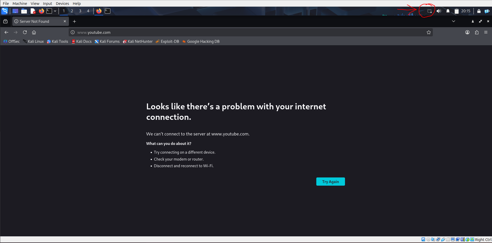

**Kuva 1.** Internet-yhteys poistettu virtuaalikoneesta

Alla olevassa kuvassa puolestaan minulla on internet-yhteys jälleen päällä, joka näkyy kuvassa kuvakkeena, jonka olen merkannut. Olin päässyt myös wikipedian sivuille.

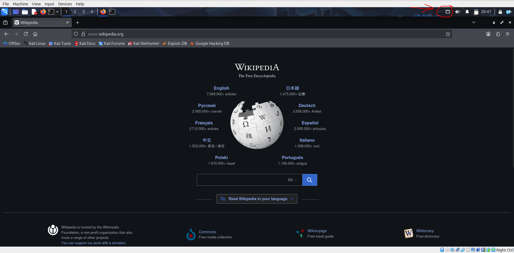

**Kuva 2.** Internet-yhteys palautettu virtuaalikoneeseen

## c) Wireshark. Asenna Wireshark. Sieppaa liikennettä Wiresharkilla. (Vain omaa liikennettäsi. Voit käyttää tähän esimerkiksi virtuaalikonetta).

**23.10.2025 Klo 20.51**

Oli vuorossa wiresharkin asennus, jonka suoritin opettajan Tero Karvisen ohjeita noudattaen. Komennot:

```bash
sudo apt-get update

sudo apt-get install wireshark
```

Minulle ei tullut ilmoitusta, haluanko sallia myös ei-pääkäyttäjien olevan oikeutettu kaappaamaan paketteja. Kävin tarkastamassa ryhmään "wireshark" kuuluvat käyttäjät. Kyseisestä ryhmästä löytyi käyttäjäni, joten kaikki oli kunnossa.

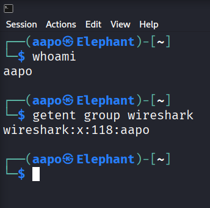

Kuvassa:

- getent group wireshark = Hakee tiedostosta /etc/group syötteen "wireshark" kohdasta

- wireshark\:x\:118:aapo
  
  - wireshark = Ryhmän nimi
  
  - x = Ryhmän salasana, joka tässä tapauksessa on x. Tämä x tarkoittaa, että salasana on salattu ja sijaitsee tiedostossa /etc/gshadow
  
  - 118 = Ryhmän tunniste (GID = Group ID)
  
  - aapo = Ryhmään kuuluvat käyttäjät, tässä tapauksessa vain minun "aapo" käyttäjä

(Stack Exchange Inc. URL: [Output of getent group.)](https://askubuntu.com/questions/811513/output-of-getent-group.)

**24.10.2025 Klo 11.02**

Tämän jälkeen komentona oli

```bash
wireshark #Avaa käyttäjälläni wireshark-ohjelman graafisen käyttöliittymän
```

Avasin Mozilla Firefoxin selaimen, joka otti yhteyden aloitussivuun [kali.org](kali.org). Tämän jälkeen menin katsomaan wiresharkilla kaapattua liikennettä. Pysäytin liikenteen kaappaamisen, jotta on helpompi aloittaa analysoiminen.

 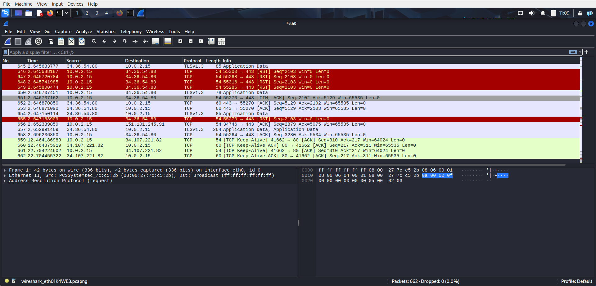

**Kuva 3.** Kaappaus liikenteestä wiresharkilla

## d) Oikeesti TCP/IP. Osoita TCP/IP-mallin neljä kerrosta yhdestä siepatusta paketista. Voit selityksen tueksi laatikoida ne ruutukaappauksesta. (Voit käyttää vastauksesi osana ruutukaappaustasi h0-tehtävästä, mutta tässä tehtävässä tarvitaan myös sanallinen selitys.)

**24.10.2025 Klo 11.40**

Otin tehtävään tarkasteluksi c-kohdassa kaapatusta liikenteestä yhden paketin.

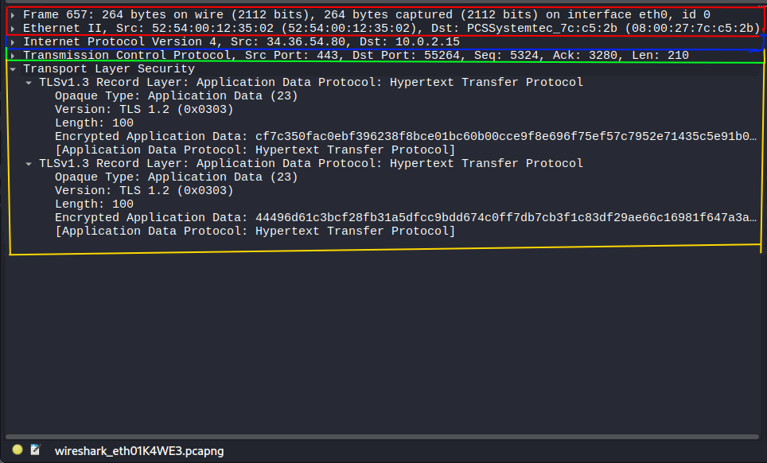

**Kuva 4.** Pakettikohtaiset TCP/IP kerrokset wiresharkissa

Kuvassa punaisella värillä laatikoitu alue on TCP/IP-mallin linkkikerros (Link layer), joka on lähiverkkoon (LAN) liittyvä kerros. Siinä yhtenä tärkeänä protokollana toimii fyysinen osoite, eli MAC-osoite (Media Access Control -osoite). Jokaisella verkon laitteella on oma MAC-osoite, jonka avulla ne voivat viestiä lähiverkossa. Tässä tapauksessa lähiverkon ethernet-protokollaa hyödynnetään MAC-osoitteen rinnalla. "Src: 52\:54\:00\:12\:35:02" on lähettävän laitteen MAC-osoite (tässä tapauksessa virtuaalikoneeni oletusyhdyskäytävä) ja "Dst: 08\:00\:27\:7c\:c5:2b" on vastaanottajalaitteen MAC-osoite (tässä tapauksessa virtuaalikoneeni MAC-osoite).

Sinisellä rajaamani alue puolestaan on TCP/IP-mallin internet-kerros (Internet layer), joka on tarkoitettu välittämään tietoa lähiverkkojen välillä. Lähiverkkojen välistä liikennettä kuvaa termi WAN (Wide Area Network). Yhtenä tärkeimpänä protokollana kerroksessa on IP eli internet protokolla (Internet Protocol). IP:stä on olemassa versiot 4 ja 6. Tapauksessani käytetään versiota 4. "Src: 34.36.54.80" on lähettävän tahon osoite, joka tapauksessani on julkinen IP-osoite, koska se ei ole yksityisten osoitteiden avaruudessa. "Dst: 10.0.2.15" on vastaanottavan laitteen IP-osoite, joka tässä tapauksessa on virtuaalikoneeni yksityinen IP-osoite, koska se on liitetty virtuaalikoneeni verkkoporttiin (network interface) ja se on yksityisen IP-osoite avaruuden osoite.

Vihreällä rajattu on TCP/IP-mallin siirtokerros (Transport layer), jonka tehtävänä on avustaa päästä päähän tiedonsiirto sovelluskerrokselle (Application layer). TCP- ja UDP-protokollat ovat tunnetuimmat siirtokerroksen protokollat. TCP on luotettavampi protokolla kuin UDP, mutta TCP on kompleksisempi, joka aiheuttaa tiedonsiirron nopeuteen ja yksinkertaisuuteen liittyviä ongelmia. (Wikipedia. URL: [Transport layer - Wikipedia.](https://en.wikipedia.org/wiki/Transport_layer))

Tapauksessani on käytetty TCP-protokollaa (Transmission Control Protocol). Lähdeporttina tapauksessa toimii 443, joka on tunnettujen porttien listalla salatun http-protokollan portti ja vastaanottajan porttina 55264, joka on virtuaalikoneeni portti. "Seq: 5324" ja "Ack: 3280" ovat tietoja, joilla voidaan seurata segmenttien luotettavuutta. "Len: 210" on puolestaan segmentin "payloadin" pituus tavuina. Payload on ylemmän kerroksen dataa, joka tässä tapauksessa on sovelluskerroksen http-dataa, mutta suojattuna tls-protokollalla (Transport layer security protocol).

Keltaisella rajaamani alue on sovelluskerros. Siinä on tapauksessani http-dataa suojattuna tls-protokollalla. Kohdassa "encrypted application data" on http-dataa, joka on salattu.

## e) Mitäs tuli surffattua? Avaa [surfing-secure.pcap](https://terokarvinen.com/verkkoon-tunkeutuminen-ja-tiedustelu/surfing-secure.pcap). Tutustu siihen pintapuolisesti ja kuvaile, millainen kaappaus on kyseessä. Tässä siis vain lyhyesti ja yleisellä tasolla. Voit esimerkiksi vilkaista, montako konetta näkyy, mitä protokollia pistää silmään. Määrästä voit arvioida esimerkiksi pakettien lukumäärää, kaappauksen kokoa ja kestoa.

**24.10.2025**

Tiedostossa ensimmäiset paketit ovat DNS-kyselyjä, jotka kohdistuvat domainiin www.google.com. Lisäksi terokarvinen.com domainilla tehdään DNS-kyselyitä. Siirtokerroksen protokollista TCP on eniten käytetty kaappauksessa. Sovelluskerroksen protokollissa on paljon http- ja tls-protokollaa käytetty, mutta myös aiemmin mainitsemaani DNS-protokollaa ja Quic-protokollaa on käytetty.

Internet-kerroksen protokollista on käytetty IPv4-protokollaa. Myös ARP-kyselyitä on käytetty, joka voidaan jossain määrin luokitella internet-kerroksen protokollaksi, koska siinä selvitetään lähiverkon IPv4-osoitetta. Tiedonsiirto tapahtuu kuitenkin linkkikerroksen MAC-osoitteita hyödyntäen.

Koneiden määrästä voi mainita sen verran, että IP-osoitteiden perusteella lähiverkossa käytetään kahta laitetta. Olettaisin ip-osoitteen 192.168.122.7 olevan päätelaitteen, koska DNS-kysely lähtee osoitteesta 192.168.122.7 osoitteeseen 192.168.122.1, jonka oletan olevan oletusyhdyskäytävä. Myös vastaukset kyselyihin tulee osoitteiden käänteisessä järjestyksessä. Lisäksi on tietenkin julkisia IP-osoitteita seassa.

Paketteja on 283 kpl ja kaappauksen ensimmäisen paketin saapumisaika on Mar 28, 2025 15\:28:09.043495000 UTC sekä kaappauksen viimeisen paketin saapumisaika on Mar 28, 2025 15\:28:16.579175000 UTC. Tästä voi päätellä, että kaappaus on kestänyt  n. 7 sekuntia.

## f) Vapaaehtoinen, vaikea: Mitä selainta käyttäjä käyttää? [surfing-secure.pcap](https://terokarvinen.com/verkkoon-tunkeutuminen-ja-tiedustelu/surfing-secure.pcap) (Päivitys 2025-03-31 w14 ma - muutin tehtävän vapaaehtoiseksi Giang:n suosituksesta)

Yritin pikaisesti etsiä selaimesta tietoa tuloksetta, mutta ajanpuutteen vuoksi en paneutunut tehtävään enempää.

## g) Minkä merkkinen verkkokortti käyttäjällä on? [surfing-secure.pcap](https://terokarvinen.com/verkkoon-tunkeutuminen-ja-tiedustelu/surfing-secure.pcap)

**25.10.2025 Klo 21.20**

Yritin etsiä tietoa MAC-osoitteen 52\:54\:00\:2f\:e1:e5 valmistajasta. Osoitteen OUI (Orgranization Unique Identifier) on aina 3 ensimmäistä oktettia, tässä tapauksessa 52\:54:00.  En löytänyt tietoa ainakaan heti, mutta osoitteessa [MAC 52:54:00 | MAC Address Lookup](https://maclookup.app/search/result?mac=52:54:00) ilmoitettiin, että saattaisi olla Realtekin verkkokortti. Kysyin Gemini tekoälyltä myös asiasta (Syöte: what is manufacturer of mac oui 52\:54:00), joka vastasi lähes varmasti verkkokortin olevan virtualisointipohjainen verkkokortti. Lisäksi Gemini vastasi, että verkkokortti luotaisiin QEMU-virtualisointia hyödyntäen.

**25.10.2025 Klo 22.00**

Katsoin myös IEEE:n sivuilta, mutta en löytänyt kyseistä OUI:tä (IEEE. URL: [Standards-oui](https://standards-oui.ieee.org/). Löysin artikkelin, jonka mukaan kyse olisi todennäköisesti LAA (Locally Administered MAC Address), joka ei ole liitettävissä mihinkään valmistajaan. LAA-osoitteilla ei ole IEEE:n tietokannassa merkintöjä ja niitä voidaan luoda ohjelman toimesta. (macaddresslookup.io. URL: [Locally vs Universally Administered MAC Addresses: What’s the Difference?](https://macaddresslookup.io/blogs/what-is-the-difference-between-locally-administered-and-universally-administered-mac-addresses).) Uskon siis hyvin vahvasti kaappauksen olevan virtuaalikoneella toteutettu. Lisäksi paketeista näkee, että LAA:n bitti on asetettu ylös sekä huomionarvoista on kohdeosoitteen sama OUI-osa, kuin lähettävän osoitteen, joten tämäkin viittaa virtuaalikoneeseen. Virtuaalikoneiden oletusyhdyskäytävä on myös tietääkseni virtuaalinen, jollei sitä erikseen laita asetuksista kuulumaan samaan verkkoon kuin "host" kone.

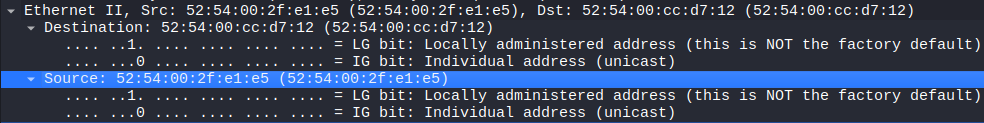

**Kuva 5.** Paketista näkyy kuinka LAA bitti on ylhäällä

Aikaa oli mennyt tehtävän tekemiseen jo melko paljon, sekä uskoin vahvasti, että LAA-osoitetta on lähes mahdoton yhdistää mihinkään verkkokortin valmistajaan, joten jatkoin seuraavaan tehtävään.

## h) Millä weppipalvelimella käyttäjä on surffaillut? [surfing-secure.pcap](https://terokarvinen.com/verkkoon-tunkeutuminen-ja-tiedustelu/surfing-secure.pcap)

- Huonoja uutisia: yhteys on suojattu TLS-salauksella.

**26.10.2025 Klo 11.27**

Aloitin etsimisen huomaamalla, että kaikissa "Client Hello" paketeissa luki "SNI=*(domain)*". SNI tulee sanoista Server Name Indication, joka kuitenkin oikeasti kertoo domainin, ei niinkään käytettävää weppipalvelinta (Cloudflare, Inc. URL: [What is SNI? How TLS server name indication works](https://www.cloudflare.com/learning/ssl/what-is-sni/).)

Oletin, että tls-otsakkeista olisi voinut löytyä tietoa weppipalvelimesta, mutta kuten tehtävänannossa todettiin, ne olisivat salattuja. Vilkaisin kuitenkin niitä, mutta en löytänyt mitään.

Joka tapauksessa yritin saada raportin tekohetkellä tiedon weppipalvelimesta, koska paketeissa näkyi domain, johon otettiin yhteyttä. Tällöin ajattelin itse voivani ottaa yhteyttä domainiin ja mahdollisesti selvittää palvelimen.

**26.10.2025 Klo 12.07**

Aloitin tutkimalla, miten saisin wiresharkin liikenteen näkyviin ilman salausta. Yhdistelin tietoja wiresharkin sivuilta (Wireshark. URL: [TLS - Wireshark Wiki](https://wiki.wireshark.org/TLS#extracting-decryption-secrets-to-a-text-file)), youtubesta käyttäjän Chris Greer videosta (Chris Greer. URL: [How to DECRYPT HTTPS Traffic with Wireshark - YouTube](https://www.youtube.com/watch?v=5qecyZHL-GU)) sekä Gemini tekoälyltä (Syöte: how to decrypt data in wireshark).

Minun piti ensimmäiseksi lisätä ympäristömuuttuja, jonka tein polussa /home/aapo komennolla

```bash
export SSLKEYLOGFILE=/home/aapo/Desktop/sslkeylog.log
```

Tämä komento asetti SSLKEYLOGFILE-muuttujan nykyiseen shelliin ja kaikkiin prosesseihin, jotka aloitetaan nykyisestä shellistä (Stack Exchange Inc. URL: [bash - How do I add environment variables? - Ask Ubuntu](https://askubuntu.com/questions/58814/how-do-i-add-environment-variables)).

Tämän jälkeen komennot polussa /home/aapo

```bash
touch Desktop/sslkeylog.log #Luo tiedoston sslkeylog.log hakemistopolkuun /home/aapo/Desktop/

wireshark & #Ajaa wiresharkin nykyisessä shellissä taustalla

firefox & #Ajaa firefoxin nykyisessä shellissä taustalla
```

Tämän jälkeen menin selaimella osoitteeseen terokarvinen.com, mutta huomasin sslkeylog.log-tiedoston olevan tyhjä. Selvittelin asiaa netistä hieman aikaa, jolloin totesin todennäköisesti ongelman olevan firefox selaimessa, joka on versioltaan firefox-esr. Ilmeisesti kyseisessä versiossa on liian tiukat konfiguroinnit haluamaani tehtävään.

**26.10.2025 Klo 13.00**

Tämän jälkeen lähdin asentamaan chromium-selainta, koska se olisi helposti ladattavissa suoraan virallisesta reposta.

Annoin polussa /home/aapo, komennot

```bash
sudo apt-get update #Päivittää paikalliset paketit

sudo apt-get install chromium #Lataa ja asentaa chromiumin
```

Poistin tässä välissä varmuuden vuoksi vanhan sslkeylog.log-tiedoston ja loin sen uudelleen samaan polkuun /home/aapo/Desktop/sslkeylog.log.

Komentoja polussa /home/aapo

```bash
wireshark &

chromium &
```

Sitten menin sivuille terokarvinen.com chromium selaimella, jonka jälkeen tarkastin lokitiedoston, jos sinne olisi tullut tietoja. Siellä niitä olikin kuten alla olevasta kuvasta ilmenee. Laitoin kuvan vain tiedoston koosta tietoturvasyistä.

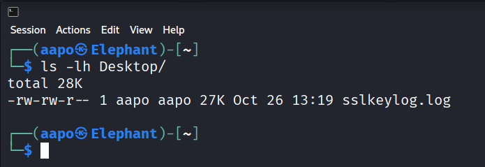

**Kuva 6.** "sslkeylog.log" tiedoston koko "Desktop" hakemistossa

Rivillä oleva "27K" tarkoittaa, että tiedosto on 27KB (27 kilotavua).

**26.10.2025 Klo 13.25**

Lisäsin ohjeiden mukaan wiresharkista "Edit --> Preferences -->Protocols --> TLS" kohdasta (Pre)-Master-Secret log filename kohtaan tiedostopolun /home/aapo/Desktop/sslkeylog.log.

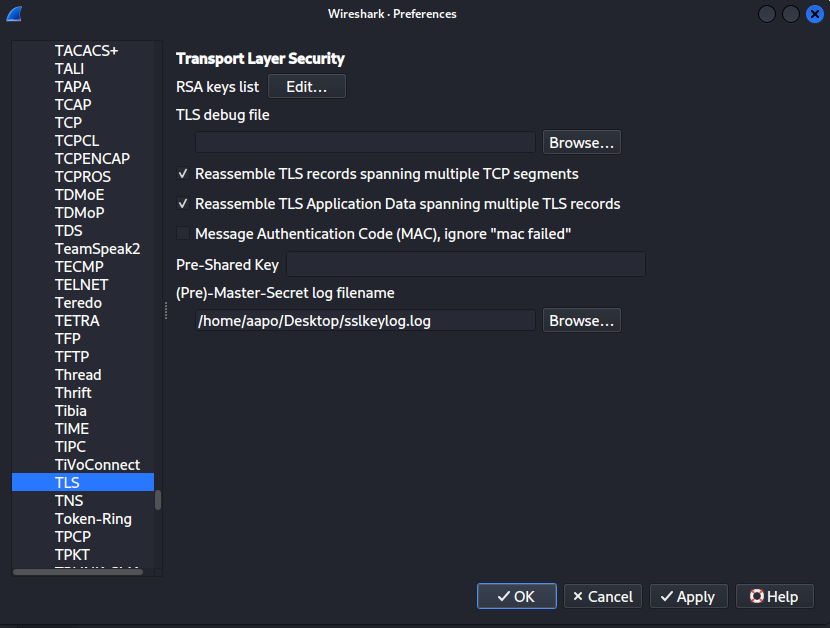

**Kuva 7.** Lokitiedoston lisääminen wiresharkin asetuksista

Tämän jälkeen löysinkin raportin tekohetkellä olevan weppipalvelimen, mutta tämä ei toki tarkoita sitä, että weppipalvelin olisi ollut sama tehtävänannossa olleessa kaappauksessa.

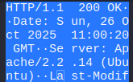

**Kuva 8.** Salaamaton liikenne osoitteesta terokarvinen.com

Weppipalvelin oli raportintekohetkellä Apache, versio 2.2.14 (Ubuntu)

## i) Analyysi. Sieppaa pieni määrä omaa liikennettäsi. Analysoi se, eli selitä mahdollisimman perusteellisesti, mitä tapahtuu. (Tässä pääpaino on siis analyysillä ja selityksellä, joten liikennettä kannattaa ottaa tarkasteluun todella vähän - vaikka vain pari pakettia. Gurut huomio: Selitä myös mielestäsi yksinkertaiset asiat.)

**26.10.2025 Klo 18.54**

Aloitin tehtävän kaappaamalla wireshark liikennettä chromium selaimella, joten wireshark ja chromium auki, jonka jälkeen menin osoitteeseen google.com. Tämän jälkeen kävin pysäyttämässä kaappauksen wiresharkista.

Otin tarkasteluun kyseisenlaisen paketin.

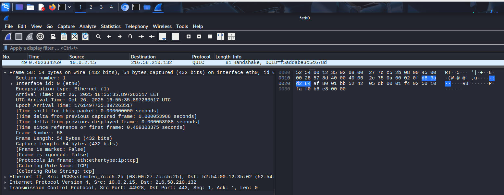

**Kuva 9.** Kaapattu paketti, josta tein analyysin

Oikealla puolella onkin paketin tavut näytettynä. Tavu osiosta näkee hexadesimaaleina paketin datan. (Sharpe, Warnicke & Lamping. URL: [3.20. The “Packet Bytes” Pane](https://www.wireshark.org/docs/wsug_html_chunked/ChUsePacketBytesPaneSection.html).)  

Ensimmäisellä rivillä on framen numero kaappauksessa, joka on tässä tapauksessa 58. Wiresharkin tukisivuston perusteella sain käsityksen, että "bytes on wire" tarkoittaisi paketin todellista kokoa ja taas "bytes captured" tarkoittaisi kaapattua määrää, jota on mahdollista ilmeisesti muuttaa (URL: [bytes on wire vs. bytes captured](https://osqa-ask.wireshark.org/questions/46163/bytes-on-wire-vs-bytes-captured)).

"interface eth0, id" on selkeästi verkkoportti (network interface) ja sen tunniste eli id.

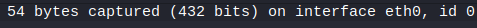

**Kuva 10.** "Interface" osio kaapatusta paketista.

"Encapsulation type" on selkeästi käytetty protokolla lähiverkossa, tässä tapauksessa ethernet. Paketissa näkyy myös selkeästi aikoja, jolloin paketit on saapunut kohdissa "Arrival Time", "UTC Arrival Time" ja "Epoch Arrival Time".

"Protocols in frame" kohdassa on paketissa käytetyt protokollat eri kerroksissa. Aiemmin linkkaamastani Sharpen, Warnicken ja Lampingin 11.3. Packet colorization kohdasta saa käsityksen, että "Coloring Rule Name" ja "Coloring rule string" liittyvät vain wiresharkin käyttöliittymän väreihin.

**26.10.2025 Klo 19.51**

Seuraavaksi siirryin seuraavaan osioon paketista, joka liittyy vieläkin lähiverkon linkkikerrokseen.

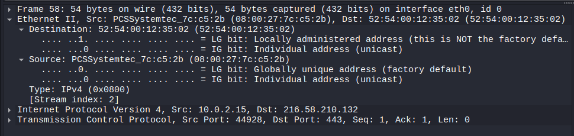

**Kuva 11.** Linkkikerroksen toinen osa

Tässä osiossa näkyi uudestaan Ethernet-protokollan käyttö. Lisäksi oli lähde ja kohde MAC-osoitteet sekä LG bit, joita avasinkin jo aikaisemmassa tehtävässä. Selkeästi "IG bit" tarkoittaa, että tässä tapauksessa, kun bitti on alhaalla eli 0, MAC-osoite on unicast-osoite, eikä esim. multicast tai broadcast. Lisäksi "LG bit" on alhaalla eli 0 lähde MAC-osoitteessa, joten tämä on "Globally unique address". Tämä tarkoittanee sitä, että MAC-osoitteen voi yhdistää valmistajaan, kuten jo osoitteessa näkyykin "PCSSystemtec". Type: IPv4 kertoo internet-kerroksen protokollan.

Seuraavaksi oli Internet-kerroksen vuoro.

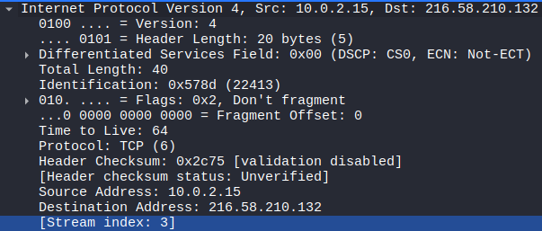

**Kuva 12.** Paketin internet-kerros

Ensimmäiseksi internet-kerroksessa ilmoitettiin käytettävän protokollan versio, joka tässä tapauksessa oli "Internet Protocol Version 4". Sitten oli lähde- ja kohde IPv4-osoitteet (Src: 10.0.2.15 ja Dst: 216.58.210.132).

Lisäksi oli otsakkeen pituus (Header Length), "Differentiated Services Field", joka kertoo paketin prioriteetin QoS (Quality of Services) periaatteiden mukaisesti. Tapauksessa prioriteetti oli oletus (0). (Wikipedia. URL: [Differentiated services - Wikipedia](https://en.wikipedia.org/wiki/Differentiated_services).)

"Explicit Congestion Notification" kenttä liittyy ilmeisesti myös datan sujuvaan liikkumiseen (Wikipedia. URL: [Explicit Congestion Notification - Wikipedia](https://en.wikipedia.org/wiki/Explicit_Congestion_Notification)). "Identification" kenttä on segmentin tunniste (Stack Exchange Inc. URL: [Identification field in Ipv4 header - Network Engineering Stack Exchange](https://networkengineering.stackexchange.com/questions/46514/identification-field-in-ipv4-header)).

"Flags" osiossa oleva "Don't fragment", kertoo kiellosta fragmentoida segmenttiä (Information Sciences Institute. URL: [RFC 791: Internet Protocol](https://www.rfc-editor.org/rfc/rfc791)). "TTL" on selkeästi "Time to live" kenttä, joka estää paketin ikuisen pyörimisen verkossa. Kun TTL on nollassa, pakettia ei enää reititetä eteenpäin.

"Header Checksum" kentät ovat IPv4-otsakkeen eheyden varmistukseen käytettäviä kenttiä (Wikipedia. URL: [Internet checksum - Wikipedia](https://en.wikipedia.org/wiki/Internet_checksum)). Tapauksessani olettaisin "validation disabled" kentän tarkoittavan, että tarkistus on pois päältä paketissa ja "Header checksum status: Unverified" tarkoittanee, että pakettia ei ole tosiaan tarkistettu eheyden varalta.

**26.10.2025 Klo 20.44**

Oli vuorossa siirtokerros.

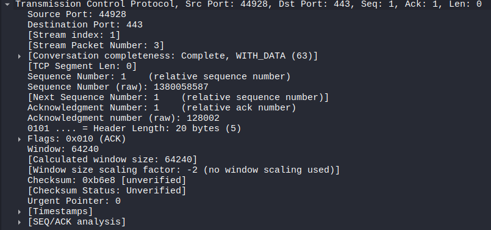

**Kuva 13.** Paketin siirtokerros

"Transmission Control Protocol" on käytettävä protokolla. Toinen yleinen olisi UDP. "Src Port" on lähdeportti ja "Dst Port" on vastaanottajan portti, joka on tapauksessa "well known" portti numero 443 salatulle http-yhteydelle. "Seq" ja "Ack" arvot ovat puolestaan segmentin toimituksen varmuuteen liittyviä tekijöitä, joilla viestitään segmenttejä, joita itse on lähettänyt ja mitä segmenttejä vastaanottaja odottaa seuraavaksi.

"Len" ilmoittaa seuraavan kerroksen datan määrän, joka tässä tapauksessa on 0. "Conversation completeness" ilmoittaa keskustelun vaiheesta, tallentamalla keskustelussa käytetyt segmenttien tyypit (Chappell. URL: [Using Wireshark's TCP Conversation Completeness](https://www.chappell-university.com/post/how-to-wireshark-tcp-conversation-completeness)).

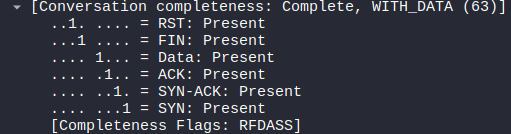

**Kuva 14.** TCP-protokollaan liittyvät segmenttien tyypit

"Flags" kohdassa on kyseisen segmentin tyypit. "Window" liittyy pakettien sujuvaan siirtoon ja vastaanottajan kykyyn käsitellä dataa (Wikipedia. URL: [TCP window scale option - Wikipedia](https://en.wikipedia.org/wiki/TCP_window_scale_option)).

**26.10.2025 Klo 21.16**

Minun piti ottaa toinen paketti, jotta voisin analysoida sovelluskerroksen dataa.

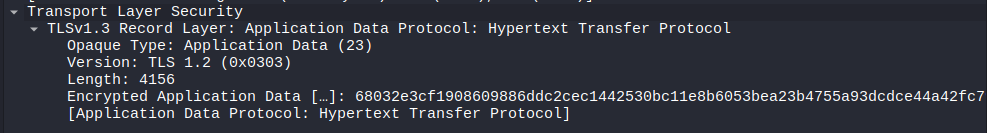

**Kuva 15.** Sovelluskerroksen tietoja

"TLSv1.3 Record Layer" ja "Version: TLS 1.2" ovat ristiriidassa keskenään, mutta ilmeisesti niiden molempien läsnäolo liittyy yhteensopivuusongelmiin (Stack Exchange Inc. URL: [Why does Wireshark show Version TLS 1.2 here instead of TLS 1.3? - Network Engineering Stack Exchange](https://networkengineering.stackexchange.com/questions/55752/why-does-wireshark-show-version-tls-1-2-here-instead-of-tls-1-3)). Samalta riviltä näkyy, että http (Hypertext Transfer Protocol) protokollaa kuljetetaan paketissa. 

## Loppupohdintaa ja tiivistystä aiheesta

Tehtävä oli mielenkiintoinen ja haastava, mutta opettavakin. Uutta tietoakin sain paljon ja muutamia kysymyksiä heräsi esitettäväksi opettajallekin seuraavalla tunnilla. Wireshark on todella monipuolinen ohjelma, jonka voi todeta jo tehtävän tekemisessä liittyvän käytön myötä. Paljon on varmasti vielä lisää ominaisuuksia ja odotankin innolla tulevaa, sillä tämä oli vasta monesta tehtävästä ensimmäinen.

## Lähteet

Chappell, L. 6.2.2024. Using Wireshark's TCP Conversation Completeness. Luettavissa: [Using Wireshark's TCP Conversation Completeness](https://www.chappell-university.com/post/how-to-wireshark-tcp-conversation-completeness). Luettu: 26.10.2025.

Chris Greer. 16.2.2021. How to DECRYPT HTTPS Traffic with Wireshark. Youtube. Katseltavissa: [How to DECRYPT HTTPS Traffic with Wireshark - YouTube](https://www.youtube.com/watch?v=5qecyZHL-GU). Katsottu: 26.10.2025.

Cloudflare, Inc. What is SNI? How TLS server name indication works. Luettavissa: [What is SNI? How TLS server name indication works](https://www.cloudflare.com/learning/ssl/what-is-sni/). Luettu: 26.10.2025.

IEEE. Standards oui. Luettavissa: [Standards-oui](%5Bhttps://standards-oui.ieee.org/%5D(https://standards-oui.ieee.org/). Luettu: 25.10.2025.

Information Sciences Institute. 1981. INTERNET PROTOCOL. Luettavissa: [RFC 791: Internet Protocol](https://www.rfc-editor.org/rfc/rfc791). Luettu: 26.10.2025.

Karvinen, T. 28.3.2025. Network Interface Names on Linux. Luettavissa: [Network Interface Names on Linux](https://terokarvinen.com/network-interface-linux/). Luettu: 23.10.2025.

Karvinen, T. 28.3.2025. Wireshark - Getting Started. Luettavissa: [Wireshark - Getting Started](https://terokarvinen.com/wireshark-getting-started/). Luettu: 23.10.2025.

Macaddresslookup.io. 9.5.2025. What is The Difference Between Locally Administered and Universally Administered MAC Addresses?. Luettavissa: [Locally vs Universally Administered MAC Addresses: What’s the Difference?](https://macaddresslookup.io/blogs/what-is-the-difference-between-locally-administered-and-universally-administered-mac-addresses). Luettu: 25.10.2025.

MAC Address Lookup. Luettavissa: [MAC 52:54:00 | MAC Address Lookup](https://maclookup.app/search/result?mac=52:54:00). Luettu: 25.10.2025.

Sharpe, R. Warnicke, E. & Lamping, U. Wireshark User’s Guide. Version 4.7.0. Luettavissa: [Wireshark User’s Guide](https://www.wireshark.org/docs/wsug_html_chunked/index.html). Luettu: 26.10.2025.

Stack Exchange Inc. 2011. How do I add environment variables?. Luettavissa: [bash - How do I add environment variables? - Ask Ubuntu](https://askubuntu.com/questions/58814/how-do-i-add-environment-variables). Luettu: 26.10.2025.

Stack Exchange Inc. 2016. Output of getent group. Luettavissa: [command line - Output of getent group - Ask Ubuntu](https://askubuntu.com/questions/811513/output-of-getent-group). Luettu: 23.10.2025.

Stack Exchange Inc. 2018. Identification field in Ipv4 header. Luettavissa: [Identification field in Ipv4 header - Network Engineering Stack Exchange](https://networkengineering.stackexchange.com/questions/46514/identification-field-in-ipv4-header). Luettu: 26.10.2025.

Stack Exchange Inc. 2019. Why does Wireshark show Version TLS 1.2 here instead of TLS 1.3?. Luettavissa: [Why does Wireshark show Version TLS 1.2 here instead of TLS 1.3? - Network Engineering Stack Exchange](https://networkengineering.stackexchange.com/questions/55752/why-does-wireshark-show-version-tls-1-2-here-instead-of-tls-1-3). Luettu: 26.10.2025.

Tekoäly Google Gemini. gemini.google.com. Syöte: how to decrypt data in wireshark. Generoitu: 26.10.2025.

Tekoäly Google Gemini. gemini.google.com. Syöte: what is manufacturer of mac oui 52:54:00. Generoitu: 25.10.2025.

Wikipedia. 14.9.2025. TCP window scale option. Luettavissa: [TCP window scale option - Wikipedia](https://en.wikipedia.org/wiki/TCP_window_scale_option). Luettu: 26.10.2025.

Wikipedia. 19.10.2025. Explicit Congestion Notification. Luettavissa: [Explicit Congestion Notification - Wikipedia](https://en.wikipedia.org/wiki/Explicit_Congestion_Notification). Luettu: 26.10.2025.

Wikipedia. 23.8.2025. Differentiated services. Luettavissa: [Differentiated services - Wikipedia](https://en.wikipedia.org/wiki/Differentiated_services). Luettu: 26.10.2025.

Wikipedia. 9.9.2025. Internet checksum. Luettavissa: [Internet checksum - Wikipedia](https://en.wikipedia.org/wiki/Internet_checksum). Luettu: 26.10.2025.

Wireshark. bytes on wire vs. bytes captured. Luettavissa: [bytes on wire vs. bytes captured](https://osqa-ask.wireshark.org/questions/46163/bytes-on-wire-vs-bytes-captured). Luettu: 26.10.2025.

Wireshark. TLS. Luettavissa: [TLS - Wireshark Wiki](https://wiki.wireshark.org/TLS#extracting-decryption-secrets-to-a-text-file). Luettu: 26.10.2025.
<br>
<br>
<br>
<br>
<br>
<br>
*Tätä dokumenttia saa kopioida ja muokata GNU General Public License (versio 3 tai uudempi) mukaisesti. http://www.gnu.org/licenses/gpl.html*
