# h2: Lempiväri: violetti

*Tekijä: Aapo Tavio*

*Pohjana Tero Karvinen 2025: Verkkoon tunkeutuminen ja tiedustelu 2025 syksy, [Verkkoon tunkeutuminen ja tiedustelu - Network Attacks and Reconnaissance](https://terokarvinen.com/verkkoon-tunkeutuminen-ja-tiedustelu/#h1-sniff)*

## x) Lue ja vastaa lyhyesti kysymyksiin. Tässä alakohdassa x ei tällä kertaa tarvitse lukea artikkeleita kokonaan, ei tarvitse tiivistää niitä, eikä tehdä testejä koneella.

- Selitä tuskan pyramidin idea 1-2 virkkeellä. Bianco 2013: [Pyramid of Pain](http://detect-respond.blogspot.com/2013/03/the-pyramid-of-pain.html). (Katso eritoten pyramidin kuvaa.)

Tuskan pyramidissa on kyse erilaisten indikaattorien suhteesta tehtäessä havaintoja vastapuolen toiminnasta. Yhtäältä tuskan pyramidi kertoo myös vastapuolelle aiheutettavan vaikeustason, kun indikaattorit ovat piilotettuna heiltä.

- Selitä timanttimallin (Diamond Model) idea 1-2 virkkeellä. Tekijä esittelee sen aika juhlallisesti, voit myös etsiä yksinkertaisempia artikkeleita [hakukoneella](https://duckduckgo.com/?t=ftsa&q=diamond+model+attacker+capability+infrastructure&ia=web) tai kelata suoraan timantin kuvaan. Caltagirone et al 2013: [Diamond Model](https://www.threatintel.academy/wp-content/uploads/2020/07/diamond-model.pdf)

Timanttimalli on kuvaus, joka sisältää neljä tekijää, jotka ovat läsnä jokaisessa haitallisessa tapahtumassa. Neljä tekijää ovat vihollinen, kyvykkyys, infrastruktuuri ja uhri. Vihollinen käyttää siis toisinsanoen infrastruktuuria ja/tai kyvykkyyttä päästäkseen jatkamaan haitallista toimintaa uhriin/kohteeseen.

## Käytettävän ympäristön ominaisuudet

- Isäntä
  
  - Koneen malli: HP Laptop 15s-eq3xxx
  
  - Käyttöjärjestelmä: Ubuntu 24.04.3 LTS
  
  - Prosessori: AMD Ryzen™ 7 5825U with Radeon™ Graphics × 16
  
  - Muisti: 16.0 GiB
  
  - Verkkokortti: Realtek Semiconductor Co., 802.11ax Wireless
  
  - Arkkitehtuuri: x86_64
  
  - Firmware version: F.20
  
  - Kernel Version: Linux 6.14.0-33-generic

- Paikallinen virtuaalikone
  
  - Virtualisointi: Virtualbox
  
  - Käyttöjärjestelmä: Kali GNU/Linux Rolling 2025.3
  
  - Xfce Versio: 4.20

## a) *Apache log*. Asenna Apache-weppipalvelin paikalliselle virtuaalikoneellesi. Surffaa palvelimellesi salaamattomalla HTTP-yhteydellä, http://localhost . Etsi omaa sivulataustasi vastaava lokirivi. Analysoi yksi tällainen lokirivi, eli selitä sen kaikki kohdat. (Jos Apache ei ole kovin tuttu, voit tätä tehtävää varten vain asentaa sen ja testata oletusweppisivulla. Eli ei tarvitse tehdä omia kotisvuja tms.)

**31.10.2025 Klo 13.09**

Aloitin tehtävän asentamalla apachen weppipalvelimen virtuaalikoneeseeni, joka oli Kali Linux. Muistini virkistämiseksi katsoin opettajan Tero Karvisen vinkit tehtävänannosta (Karvinen. URL: [Verkkoon tunkeutuminen ja tiedustelu - Network Attacks and Reconnaissance](https://terokarvinen.com/verkkoon-tunkeutuminen-ja-tiedustelu/#h2-lempivari-violetti)).

Komennot

```bash
sudo apt-get update #Päivittää paikallisen listan saatavilla olevista paketeista


sudo apt-get install apache2 #Lataa ja asentaa apachen


sudo systemctl start apache2 #Käynnistää apachen weppipalvelimen
```

Laitoin apachen "access.log" lokitiedoston päälle, eli siis seuraamaan reaaliaikaisesti tapahtumia.

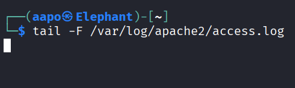

**Kuva 1.** Apachen lokitiedosto on tyhjä

Otin yhteyttä paikalliseen osoitteeseen "http://localhost" ensiksi mozilla firefox selaimella.

Tämän jälkeen komento toisella välilehdellä terminaalissa.

```bash
curl http://localhost #Tekee http-pyynnön paikalliseen ip-osoitteeseen
```

Sitten olikin lokitiedostoon ilmestynyt tietoa.

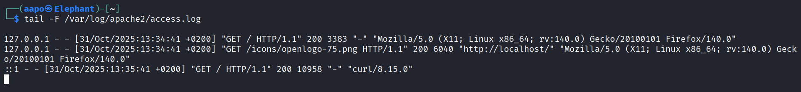

**Kuva 2.** Http-pyyntö apachen lokitiedostossa

- Kuvassa rivi: 127.0.0.1 - - [31/Oct/2025\:13\:34:41 +0200] "GET / HTTP/1.1" 200 3383 "-" "Mozilla/5.0 (X11; Linux x86_64; rv:140.0) Gecko/20100101 Firefox/140.0"
  
  - **127.0.0.1** = IP-osoite, josta pyyntö oli tullut
  
  - **Ensimmäinen väliviiva IP-osoitteen jälkeen** = Asiakkaan identiteettitieto, tässä tapauksessa sitä ei ole
  
  - **Toinen väliviiva** = Käyttäjän tunniste, jota esimerkkitapauksessa ei ole
  
  - **[31/Oct/2025\:13\:34:41 +0200]** = Pyynnön aika ja päivämäärä
  
  - **"GET / HTTP/1.1"** = GET on metodi http-pyynnössä, / on resurssi, jota pyydetään (tässä tapauksessa juurihakemisto), HTTP/1.1 on käytetty protokolla
  
  - **200** = Http:n tilakoodi, joka tässä tapauksessa ilmaisee onnistunutta suoritusta
  
  - **3383** = Objektin koko tavuina, joka on lähetetty asiakkaalle
  
  - **Mozilla/5.0 (X11; Linux x86_64; rv:140.0) Gecko/20100101 Firefox/140.0** = Käyttäjän käyttämä ohjelma, jolla pyyntö tehtiin
  
  (Girvin. URL: [Understanding the apache access log: how to view, locate, and analyze](https://www.sumologic.com/blog/apache-access-log))

## b) *Nmapped*. Porttiskannaa oma weppipalvelimesi käyttäen localhost-osoitetta ja 'nmap -A' päällä. Selitä tulokset. (Pelkkä http-portti 80/tcp riittää)

**31.10.2025 Klo 20.44**

Lähdin selvittämään ihan ensimmäiseksi mitä tehtävänannossa sanottu komento "nmap -A" tarkoittaa. Komennon ensimmäinen osa "nmap" on tietenkin ohjelma, joka suoritetaan, mutta mikä on -A valinta. Nmapin virallinen ohje auki komennolla

```bash
man nmap #Avaa nmapin manuaalin
```

Ohjeesta löysin, että -A valinnalla saadaan skannaukseen mukaan käyttöjärjestelmän havaitseminen, version havaitseminen, skript skannaus sekä jäljitysreitti (traceroute).

Skannasin seuraavaksi localhost portin 80 komennolla

```bash
nmap -A localhost
```

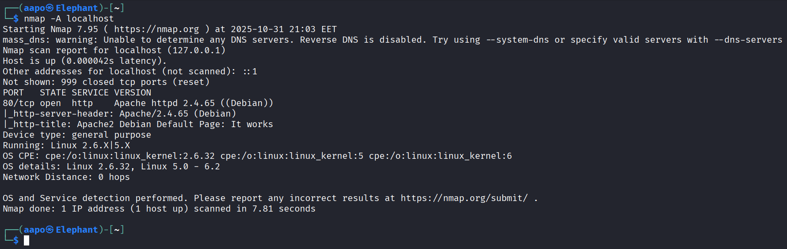

**Kuva 3.** Nmap skannauksen tulos

- Kuvassa:
  
  - **mass_dns: warning: Unable ...** = Rivi kertoo dns:n olevan pois käytöstä, ilmeisesti tiedostossa /etc/resolv.conf olevan puutteellisuuden vuoksi (Stack Exchange Inc. URL: [virtual machine - mass_dns: warning: Unable to determine any DNS servers. Reverse DNS is disabled - Unix &amp; Linux Stack Exchange](https://unix.stackexchange.com/questions/225394/mass-dns-warning-unable-to-determine-any-dns-servers-reverse-dns-is-disabled))
  
  - **Host is up (0.000042s latency)** = Kohde on saatavilla, joka tarkoittaa että nmap on vastaanottanut RST tai SYN/ACK vastauksen lähetettyyn viestiin (Nmap. URL: [Host Discovery | Nmap Network Scanning](https://nmap.org/book/man-host-discovery.html)). Lisäksi latenssi on kerrottu.
  
  - **Other addresses for localhost (not scanned): ::1** = Localhostin toinen osoite, joka on IPv6-osoite
  
  - **Not shown: 999 closed tcp ports (reset)** = Oletuksena skannataan 1000 porttia, joista tässä tapauksessa on 999 kpl suljetussa tilassa (Stack Exchange Inc.  
    
    URL: [ssh - nmap doesn&#39;t appear to list all open ports - Unix &amp; Linux Stack Exchange](https://unix.stackexchange.com/questions/238640/nmap-doesnt-appear-to-list-all-open-ports)).  
    
    Reset kertoo tavan, jolla nmap on havainnut portin olevan suljetussa tilassa. Reset on siis RST-viesti segmentissä.  
    
    (ChatGPT-tekoäly. Syöte: what is not shown: 999 closed tcp ports (reset) mean?)
  
  - **Port 80/tcp** = Porttinumero, joka on skannattu sekä protokolla, jota käytetään portissa
  
  - **State open** = Portin tila, joka tässä tapauksessa on auki/saatavilla
  
  - **Service http** = Palvelu, joka on havaittu kyseisessä portissa
  
  - **ersion Apache httpd 2.4.65 ((Debian))** = palvelussa käytetty sovellus ja sen versio
  
  - **http-server-header: Apache/2.4.65 (Debian)** = http-vastauksen server-otsake
  
  - **http-title: Apache2 Debian Default Page: It works** = http-vastauksen title-elementti HTML-koodissa
  
  - **Device type: general purpose** = Skannatun laitteen tyyppi, joka tässä tapauksessa on yleinen laite, jolla tarkoitetaan esim. linuxia tai windowsia
    
    (Nmap. URL: [Device Types | Nmap Network Scanning](https://nmap.org/book/osdetect-device-types.html).)
  
  - **OS CPE: cpe:/o:linux...** = Common Platform Enumeration, joka on esitysmuoto käyttöjärjestelmän sormenjäljelle/tunnisteelle (fingerprint)
  
  - **OS details: Linux 2.6.32, Linux 5.0 - 6.2** = Kohteen käyttöjärjestelmä ja sen versiot. CPE-riviä hyväksi käyttäen pystyi mielestäni päättelemään, että kyseessä on mahdollisesti kolme erilaista arvausta, koska sormenjälkeä verrataan nmapin tietokantaan. Todennäköisesti tietokanta on antanut kolme erilaista osumaa sormenjäljelle.  
    
    (Nmap. URL: [OS Detection | Nmap Network Scanning](https://nmap.org/book/man-os-detection.html).)
  
  - **Network Distance: 0 hops** = Ilmaisee reitittimien lukumäärän nmappia käyttävän koneen ja kohdekoneen välillä  
    
    (Nmap. URL: [Usage and Examples | Nmap Network Scanning](https://nmap.org/book/osdetect-usage.html)).

## c) *Skriptit*. Mitkä skriptit olivat automaattisesti päällä, kun käytit "-A" parametria? (Näkyy avoimien porttinumeroiden alta, http-blah, http-blöh...).

**1.11.2025 Klo 15.55**

Valinta "-A" sisältää oletus (default) skriptit (Nmap. URL: [Usage and Examples Default| Nmap Network Scanning](https://nmap.org/book/nse-usage.html#nse-category-default)).

Lisäksi kysyin ChatGPT:ltä: "what scripts are included in -A nmap scan". Vastauksessa mainittiin, että "-A" sisältää käyttöjärjestelmän ja version tunnistamisen sekä oletus ja jäljitysreitti (traceroute) skriptit. Lisäksi vastauksessaan tekoäly kertoi, että voin mennä itse katsomaan koneestani, mitkä kaikki skriptit kuuluvat oletus-skripteihin.

Löysin hakemistopolusta /usr/share/nmap/scripts/ skriptejä, joten tulostin yhden sellaisen näytölle. Siellä näkyi olevan "categories" kohta, jossa lukee erilaisia kategorioita, joiden avulla tekoäly kehoitti suodattamaan oletus-kategorian omaavat skriptit. Lisäksi tekoäly 

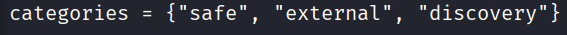

**Kuva 4.** Kategoriat tiedostosta http-xssed.nse

ChatGPT antoi lisäksi vastauksessaan komennon, jolla voin suodattaa kaikki rivit näkyville, joissa esiintyy oletus-kategoria. Komento oli

```bash
grep -R "categories *= *{.*default" /usr/share/nmap/scripts/ -n 
```

Tulosteessa oli todella paljon skriptejä, joten laitan vain alkuosan skripteistä kuvakaappauksena, koska se varmasti riittänee tehtävässä.

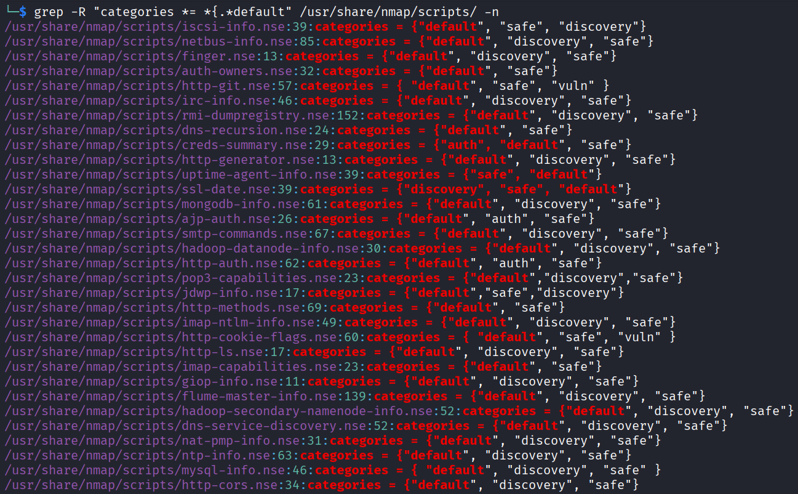

**Kuva 5.** Oletus-kategoriaan kuuluvia skriptejä

## d) *Jäljet lokissa*. Etsi weppipalvelimen lokeista jäljet porttiskannauksesta (NSE eli Nmap Scripting Engine -skripteistä skannauksessa). Löydätkö sanan "nmap" isolla tai pienellä? Selitä osumat. Millaisilla hauilla tai säännöillä voisit tunnistaa porttiskannauksen jostain muusta lokista, jos se on niin laaja, että et pysty lukemaan itse kaikkia rivejä?

**1.11.2025 Klo 17.55**

Aloitin avaamalla access.log tiedoston polusta /var/log/apache2/. Sieltä löytyikin paljon rivejä, jotka olivat nmapin jäljiltä.

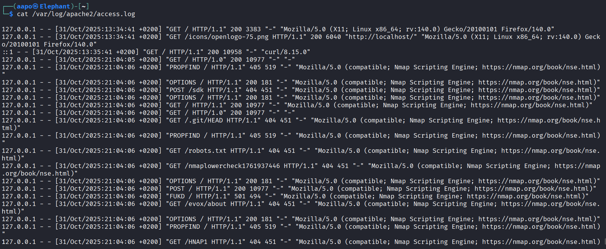

**Kuva 6.** Osa tiedostosta access.log

Huomioni kiinnittyi heti erilaisiin metodeihin, joita oli esim. "PROPFIND", "OPTIONS" ja "POST". Lähdinkin selvittämään näitä ensimmäiseksi.

Propfind vaikutti olevan http-metodi, jolla pyydetään tietoja head-metodin tavoin, mutta se palauttaa vastauksena myös XML-objekteja sekä hakemistohierarkeja  

(Stack Exchange Inc. URL: [What is HTTP Method PROPFIND used for? - Webmasters Stack Exchange](https://webmasters.stackexchange.com/questions/59211/what-is-http-method-propfind-used-for)).

Options-metodia puolestaan käytetään http-kyselyssä selvittämään tietyn URL:n tai palvelimen sallitut http-metodit  

(Mozilla. URL: [OPTIONS request method - HTTP | MDN](https://developer.mozilla.org/en-US/docs/Web/HTTP/Reference/Methods/OPTIONS)).

Fukd-metodista en löytänyt hakukoneilla mitään tietoa, mutta ChatGPT vastasi sen olevan lähes varmasti nmapin generoima satunnainen http-metodi. Ideana olisi tekoälyn mukaan, että ensin nmap lähettää options-metodin kohteeseen ja sen jälkeen satunnaisesti luoman metodin, jota se vertaa sallittuihin metodeihin.  

(ChatGPT. Olin ennen syötettä antanut aikaisemman syötteen, jossa kysyin englanniksi, mikä on fukd metodi?. Syöte: i have FUKD method in my apache log file, after i ran port scan with nmap -A)

Seuraavaksi huomioni kiinnittyi erikoisiin hakemistopolkuihin, joita nmapin tekemissä pyynnöissä oli. Selvitin "robots.txt" tiedoston taustaa, koska siihen oli tehty GET-metodilla pyyntö. Kävi ilmi, että "robots.txt" on yleinen tiedosto, jolla kehittäjät voivat antaa tietoa mihin osaan verkkosivua he toivovat robottien pääsevän. Robotti tässä yhteydessä tarkoittaa ohjelmaa, joka käy massoittain sivuja läpi.  

(Black Duck Editorial Staff. URL: [Robots.txt Security Risk Review and Mitigation | Black Duck Blog](https://www.blackduck.com/blog/robots-txt.html).)

Mielestäni robotit ovat tässä yhteydessä esim. hakukoneita. Muissakin pyynnöissä, joissa esiintyi GET-metodi, oli erilaisia hakemistopolkuja, mutta en käynyt niitä sen enempää läpi. Tietenkin ne liittyivät jotenkin tietojen saamiseen kohteesta, todennäköisesti melko samaa kaavaa noudattaen, kuin robots.txt-tiedoston kanssa.

Komennolla

```bash
cat /var/log/apache2/access.log | grep -i "nmap"
```

pystyy hakemaan kaikki rivit tiedostosta "access.log", jotka sisältävät sanan "nmap". Lisäksi "-i" valinta ottaa huomioon kaikki osumat riippumatta isoista ja pienistä kirjaimista sanassa "nmap" (Grep-komennon manuaali.)

## e) *Wire sharking*. Sieppaa verkkoliikenne porttiskannatessa Wiresharkilla. Huomaa, että localhost käyttää "Loopback adapter" eli "lo". Tallenna pcap. Etsi kohdat, joilla on sana "nmap" ja kommentoi niitä. Jokaisen paketin jokaista kohtaa ei tarvitse analysoida, yleisempi tarkastelu riittää.

**2.11.2025 Klo 9.02**

Tein tehtävänannon mukaisen kaappauksen wiresharkilla skannatessani localhostia nmapilla. Suodatin opettajan vinkkien mukaan wiresharkin näyttämään vain kehykset, jotka sisälsivät sanan "nmap".

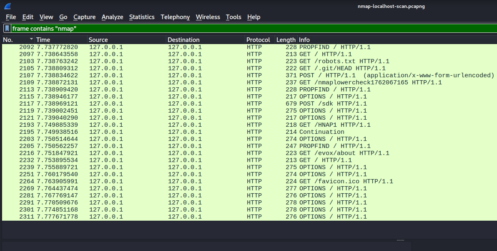

**Kuva 7.** Löytyneet kehykset suodatuksella

Löysinkin samankaltaisia merkintöjä sovelluskerroksesta, kuin apachen lokista aikaisemmin. Alla olevassa kehyksessä oli käytetty propfind-metodia.

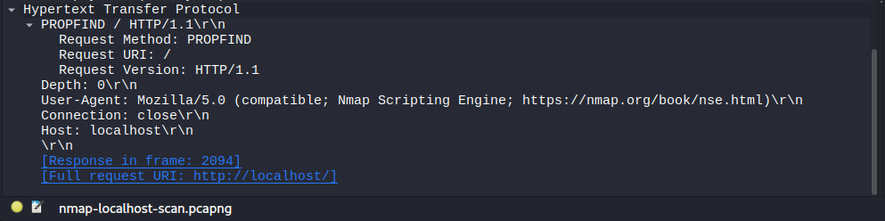

**Kuva 8.** Kehys nro 2092

Alla olevassa kuvass oli käytetty puolestaan post-metodia.

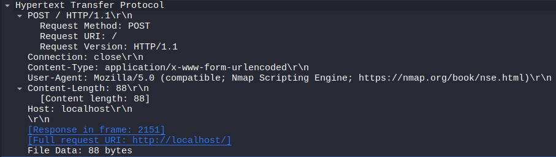

**Kuva 9.** Kehys nro 2107

## f) *Net grep*. Sieppaa verkkoliikenne 'ngrep' komennolla ja näytä kohdat, joissa on sana "nmap".

**2.11.2025 Klo 9.48**

Lähdin ensimmäiseksi selvittämään, mikä on net grep. Net grep (network grep, ngrep) on työkalu pakettien analysoimiseen, joka toimii komentorivipohjaisena. Työkalua käytetään Berkeley Packet Filter (BPF) logiikalla, jolla voidaan suodattaa haluamat tiedot verkon liikenteestä. (Wikipedia. URL: [ngrep - Wikipedia](https://en.wikipedia.org/wiki/Ngrep).)

Opettajan vinkeissä oli ngrepin käyttöön komento

```bash
sudo ngrep -d lo -i nmap
```

Lähdin selvittämään, mitä kyseinen komento oikein tekee.

Löysin ngrepin virallisesta manuaalista tietoa komennosta. Valinta "-d" tarkoittaa "dev", jolla saadaan oletusliittimen(default interface) käyttö vaihdettua liittimeen "dev". Tässä yhteydessä selkeästi oletusliitin vaihdettiin loopback-liittimeen, koska "-d" valinnan jälkeen annettiin arvo "lo".

Valinta "-i" puolestaan jätti jälleen huomiotta, onko kirjain iso vai pieni. Sana "nmap" on selkeästi säännöllinen lauseke (regular expression), jolla suodatetaan paketit liikenteestä, jotka sisältävät kyseisen sanan. BPF-suodatinta ei kyseisessä komennossa ole.

**2.11.2025 Klo 10.26**

Seuraavaksi oli vuorossa komennon ajaminen

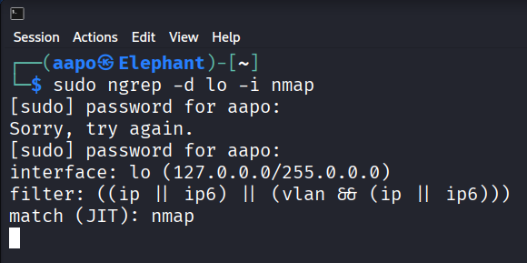

**Kuva 10.** Ngrep-skannaus päällä ilman liikennettä

Sitten ajoin toisessa shellissä

```bash
nmap -A localhost
```

Tämän jälkeen olikin tullut paljon tietoa ngrepillä. Laitoin kaksi kuvakaappausta, vaikka olisi ollut enemmänkin. Tehtävän tarkoitus toteutunee uskoakseni parilla kuvakaappauksella, koska tiedoissa olivat samoja tietoja, kuin aikaisemmissa tehtävissä ilmi tulleet.

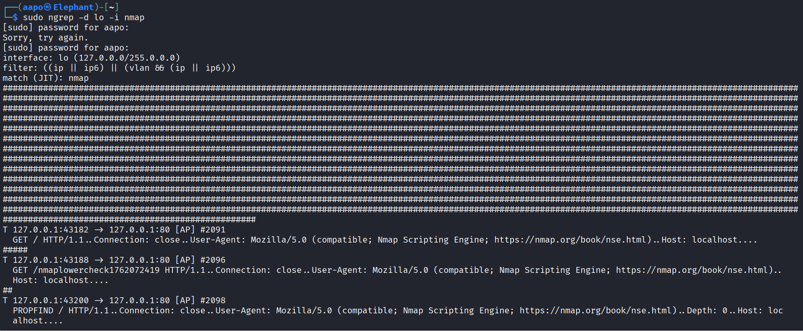

**Kuva 11.** Ngrepillä saatuja tietoja

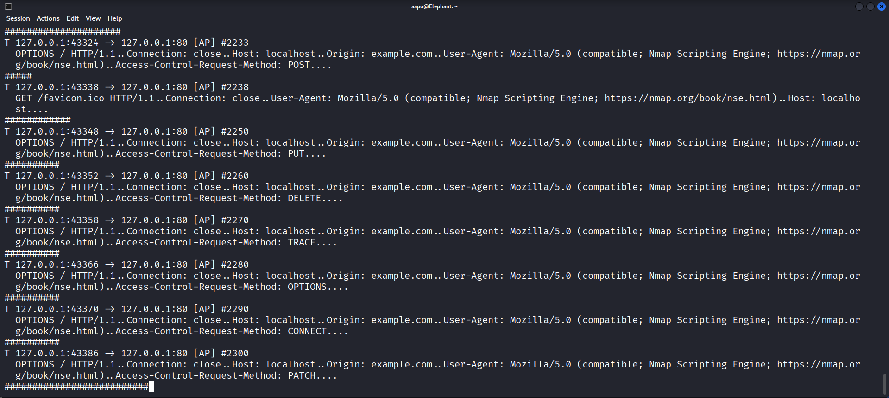

**Kuva 12.** Lisää ngrepillä saatuja tietoja

Tiedoissa näkyi samoja elementtejä kuin aikaisemmin. Kuitenkin yksi asia kiinnitti huomioni kaappauksessa, joka oli "Access-Control-Request-Method". Selvitin kyseistä kohtaa ja löysin, että se on "preflight request"-otsake, jolla ilmaistaan tulevien http-pyyntöjen metodeja. "Preflight request" on aina itsessään options-metodi.  

(Mozilla. URL: [Access-Control-Request-Method header - HTTP | MDN](https://developer.mozilla.org/en-US/docs/Web/HTTP/Reference/Headers/Access-Control-Request-Method).)

Samalla selvisi, että "Access-Control-Allow-Headers" on palvelimen vastauksessa, joka vastaa "Access-Control-Request-Method" otsakkeen arvoihin perustuen (Mozilla. URL: [Access-Control-Request-Headers header - HTTP | MDN](https://developer.mozilla.org/en-US/docs/Web/HTTP/Reference/Headers/Access-Control-Request-Headers)).

## g) *Agentti*. Vaihda nmap:n user-agent niin, että se näyttää tavalliselta weppiselaimelta.

**2.11.2025 Klo 16.43**

Huomasin ensimmäiseksi opettajan vinkeistä komennon.

```bash
--script-args http.useragent="BSD experimental on XBox350 alpha (emulated on Nokia 3110)"
```

Ajattelin tämän liittyvän varmasti tehtävään, mutta halusin tietää vähän lisää, mitä tarkalleen ottaen komento tekee.

Löysin nmapin virallisesta manuaalista terminaalin kautta tietoja (komento: "man nmap"), joiden mukaan "--script-args" valinnalla voidaan antaa argumentteja skriptiin. Valinta "--script" puolestaan antaisi mahdollisuuden valita, mitä skriptejä käytetään? Käsitykseni oli, että valinta "--script-args" tarvitaan vain komentoon, koska oletus-skripteihin kuului jo valmiiksi "http.useragent".

Katsoin apachen lokeista, miltä normaalisti user-agent näytti, koska olin jo aikaisemmin mennyt firefox-selaimen kautta localhost-osoitteeseen.

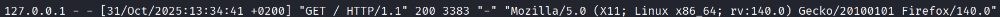

**Kuva 13.** Normaalin user-agent tiedon esitystapa

## h) *Pienemmät jäljet*. Porttiskannaa weppipalvelimesi uudelleen localhost-osoitteella. Tarkastele sekä Apachen lokia että siepattua verkkoliikennettä. Mikä on muuttunut, kun vaihdoit user-agent:n? Löytyykö lokista edelleen tekstijono "nmap"?

Lähdin tämän jälkeen vain kopioimaan yllä olevassa kuvassa esiintyneen user-agent kohdan ja liitin sen http.useragentin arvoksi.

Näin ollen avasin wiresharkin ja tein skannauksen komennolla

```bash
nmap -A localhost --script-args http.useragent="Mozilla/5.0 (X11; Linux x86_64; rv:140.0) Gecko/20100101 Firefox/140.0"
```

Skannaus onnistui.

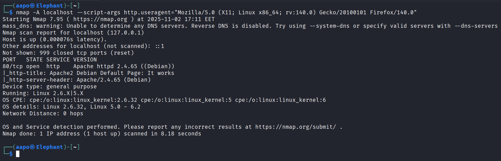

**Kuva 14.** Skannauksen tulos

Tulos oli toivotunlainen, koska ainakin wiresharkissa user-agent kohdassa oli haluttu arvo.

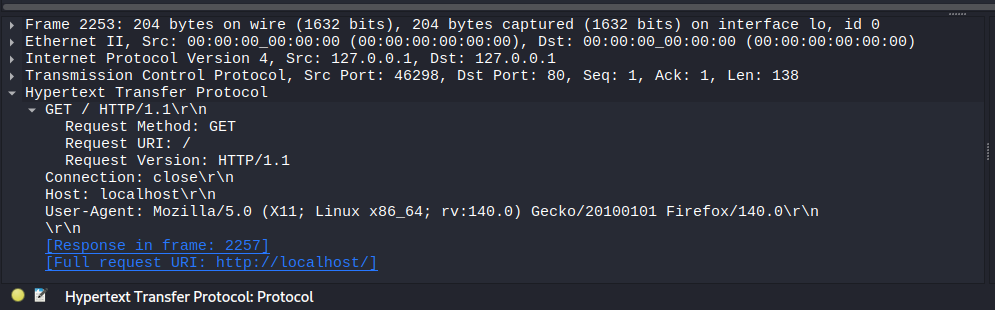

**Kuva 15.** Kehys nro 2253

Alla vielä options-metodilla lähetetty frame, jossa user-agent oli myös toivotunlainen.

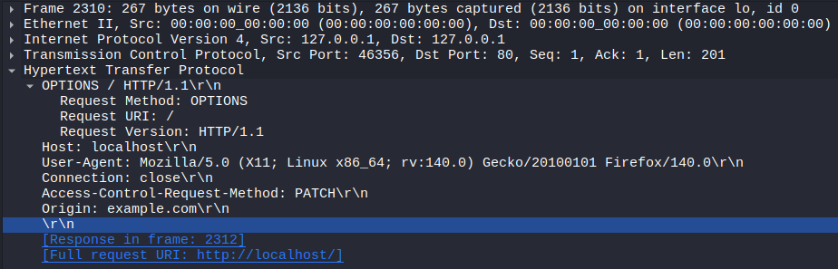

**Kuva 16.** Kehys nro 2310

Kävin vielä katsomassa apachen access.log tiedostosta, oliko sielläkin oikea user-agent? Sieltä löytyi halutunlaista user-agenttia.

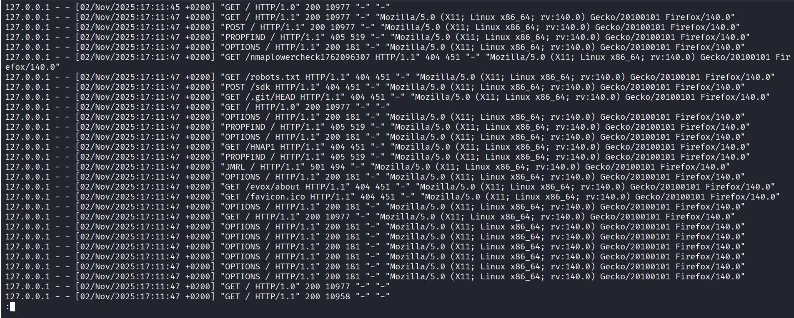

**Kuva 17.** User-agent muutettuna apachen lokitiedostossa apache.log

Sain siis peitettyä täydellisesti "nmap" merkkijonon user-agent kohdasta. Ainoastaan yhdessä get-metodilla toteutetussa kyselyssä oli vielä sana "nmap".

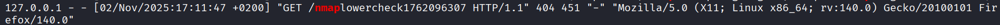

**Kuva 18.** Viimeinen "nmap" merkkijono

Löysin saman paketin vielä wiresharkistakin.

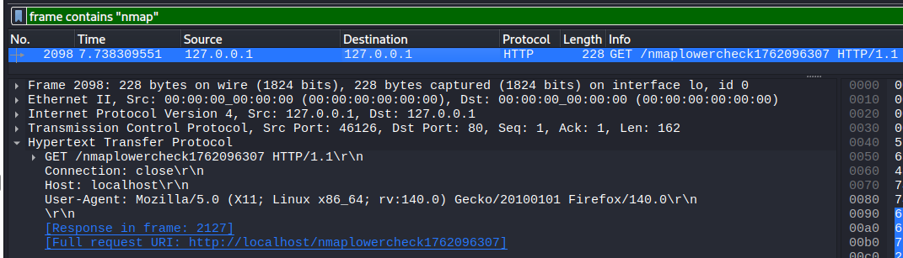

**Kuva 19.** Viimeinen "nmap" merkkijono wiresharkissa

## i) Hieman vaikeampi: *LoWeR ChEcK*. Poista skritiskannauksesta viimeinenkin "nmap" -teksti. Etsi löytämääsi tekstiä /usr/share/nmap -hakemistosta ja korvaa se toisella. Tee porttiskannaus ja tarkista, että "nmap" ei näy isolla eikä pienellä kirjoitettuna Apachen lokissa eikä siepatussa verkkoliikenteessä. (Tässä tehtävässä voit muokata suoraan lua-skriptejä /usr/share/nmap alta, 'sudoedit'. Muokatun version paketoiminen siis rajataan ulos tehtävästä.)

**2.11.2025 Klo 18.38**

Hain rivit hakemistosta /usr/share/nmap/, jotka sisälsivät tekstin "/nmaplowercheck1762096307", komennolla

```bash
grep -ir "/nmaplowercheck1762096307"
```

Mitään ei kuitenkaan ilmaantunut vastauksena.

Koitin etsiä seuraavaksi erilaisella hakusanalla, komennolla

```bash
grep -ir "nmaplowerch"
```

jolloin tärppäsi.

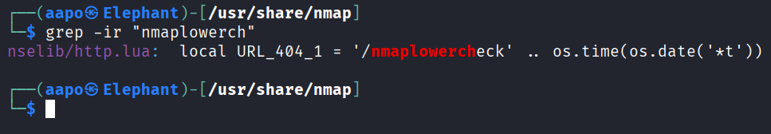

**Kuva 20.** Viimeinen "nmap" merkkijono paikannettu

Näköjään tiedostossa "http.lua" on lisätietoa, että muokattavana oleva rivi liittyy 404 http-koodin tarkasteluun. Kommentoin itse rivin vain pois, mutta ehkä joissain tilanteissa olisi tarpeellista löytää jokin korvike elementille.

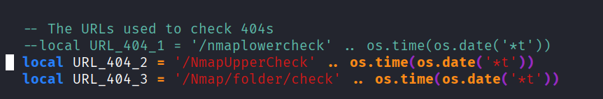

**Kuva 21.** Rivi kommentoituna

Sitten skannasin portit tutulla komennolla

```bash
nmap -A localhost --script-args http.useragent="Mozilla/5.0 (X11; Linux x86_64; rv:140.0) Gecko/20100101 Firefox/140.0"
```

Vastauksena tuli tuttua tekstiä, mutta myös muutama virheilmoitus skriptien ajamisesta. Merkkasin punaisella virheet.

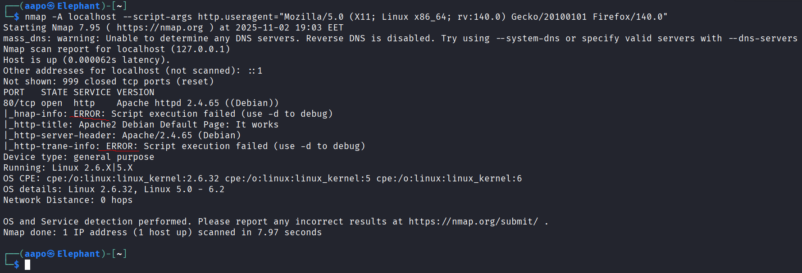

**Kuva 22.** Vastaus skannauksesta tiedostojen muuttamisen jälkeen

Apachen lokitiedostosta "access.log" ei löytynyt sanaa "nmap" enää.

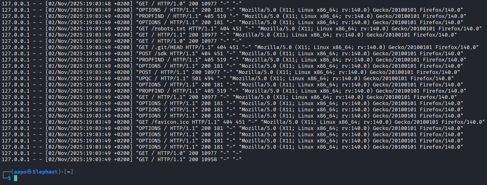

**Kuva 23.** Merkkijono "nmap" oli poistunut apachen lokista

En huomannut laittaa wiresharkia päälle, joten tein uuden skannauksen wiresharkin ollessa päällä samalla komennolla kuin viimeksi tehty skannaus. Alla olevasta kuvasta voi päätellä, että peittely onnistui.

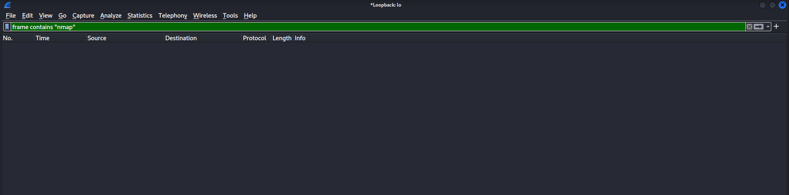

**Kuva 24.** Merkkijonoa "nmap" ei löytynyt wiresharkistakaan

## j) Vapaaehtoinen, vaikea: *Invisible, invincible*. Etsi jokin toinen nmap:n skripti, jonka verkkoliikenteessä esiintyy merkkijono "nmap" isolla tai pienellä. Muuta nmap:n koodia niin, että tuo merkkijono ei enää näy verkkoliikenteessä.

**2.11.2025 Klo 19.34**

Kysyin ChatGPT:ltä mitkä skriptit voisivat olla hyödyllisiä kokeilla. Vastauksessa oli "ssl-cert" skripti, joten katsoin sen sisältävän merkkijonon "nmap".

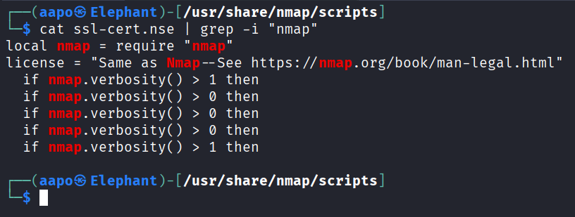

**Kuva 25.** Skriptin rivit joissa esiintyy "nmap"

Kuitenkaan skannauksen tiedoissa, ilman mitään toimenpiteitä, ei löytynyt merkkijonoa.

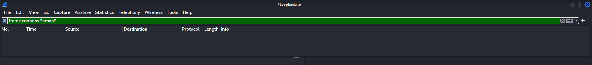

**Kuva 26.** Wireshark kaappaus ilman merkkijonoa

Katsoin vielä apachen lokista komennolla

```bash
cat /var/log/apache2/access.log | grep -i "nmap"
```

Mutta sielläkin oli vain aikaisemman skannauksen merkkijono, joten uusimmasta skannauksesta ei ollut jäänyt jälkeä.

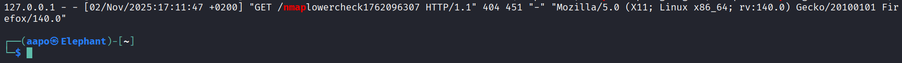

**Kuva 27.** Viimeinen osuma merkkijonolle "nmap"

Minulla oli mennyt tehtävissä jo sen verran kauan ja aika alkoi loppumaan, joten päätin lopettaa tehtävän tähän pisteeseen. Muutenkin kyseessä oli vapaaehtoinen tehtävä.

## Lähteet

Bianco, D. 1.3.2013. Enterprise Detection & Response. Luettavissa: [Enterprise Detection &amp; Response: The Pyramid of Pain](https://detect-respond.blogspot.com/2013/03/the-pyramid-of-pain.html). Luettu: 31.10.2025.

Caltagirone, S., Pendergast, A. & Betz, C. The Diamond Model of Intrusion Analysis. Luettavissa: [The Diamond Model of Intrusion Analysis](https://www.threatintel.academy/wp-content/uploads/2020/07/diamond-model.pdf). Luettu: 31.10.2025.

Girvin, D. 20.2.2025. Understanding the Apache access log: how to view, locate, and analyze. Luettavissa: [Understanding the apache access log: how to view, locate, and analyze](https://www.sumologic.com/blog/apache-access-log). Luettu: 31.10.2025.

Nmap ohje/manuaali komentoriviltä Kali Linuxilla. Komento: man nmap. Luettu: 31.10.2025.

Stack Exchange Inc. 2015. mass_dns: warning: Unable to determine any DNS servers. Reverse DNS is disabled. Luettavissa: [virtual machine - mass_dns: warning: Unable to determine any DNS servers. Reverse DNS is disabled - Unix &amp; Linux Stack Exchange](https://unix.stackexchange.com/questions/225394/mass-dns-warning-unable-to-determine-any-dns-servers-reverse-dns-is-disabled). Luettu: 1.11.2025.

Nmap. Host Discovery. Luettavissa: [Host Discovery | Nmap Network Scanning](https://nmap.org/book/man-host-discovery.html). Luettu: 1.11.2025.

Stack Exchange Inc. 2015. nmap doesn't appear to list all open ports. Luettavissa: [ssh - nmap doesn&#39;t appear to list all open ports - Unix &amp; Linux Stack Exchange](https://unix.stackexchange.com/questions/238640/nmap-doesnt-appear-to-list-all-open-ports). Luettu: 1.11.2025.

ChatGPT-tekoäly. GPT-3.5. Syöte: what is not shown: 999 closed tcp ports (reset) mean?. Generoitu: 1.11.2025.

Nmap. Device Types. Luettavissa: [Device Types | Nmap Network Scanning](https://nmap.org/book/osdetect-device-types.html). Luettu: 1.11.2025.

Nmap. OS Detection. Luettavissa: [OS Detection | Nmap Network Scanning](https://nmap.org/book/man-os-detection.html). Luettu: 1.11.2025.

Nmap. Usage and Examples. Luettavissa: [Usage and Examples | Nmap Network Scanning](https://nmap.org/book/osdetect-usage.html). Luettu: 1.11.2025.

Nmap. Usage and Examples. Luettavissa: [Usage and Examples Default | Nmap Network Scanning](https://nmap.org/book/nse-usage.html#nse-category-default). Luettu: 1.11.2025.

ChatGPT-tekoäly. GPT-3.5. Syöte: what scripts are included in -A nmap scan. Generoitu: 1.11.2025.

Stack Exchange Inc. 2014. What is HTTP Method PROPFIND used for?. Luettavissa: [What is HTTP Method PROPFIND used for? - Webmasters Stack Exchange](https://webmasters.stackexchange.com/questions/59211/what-is-http-method-propfind-used-for). Luettu: 1.11.2025.

Mozilla. OPTIONS request method. Luettavissa: [OPTIONS request method - HTTP | MDN](https://developer.mozilla.org/en-US/docs/Web/HTTP/Reference/Methods/OPTIONS). Luettu: 1.11.2025.

ChatGPT-tekoäly. GPT-3.5. Syöte: i have FUKD method in my apache log file, after i ran port scan with nmap -A. Generoitu: 1.11.2025.

Black Duck Editorial Staff. 22.3.2015. The 3 laws of robots.txt. Luettavissa: [Robots.txt Security Risk Review and Mitigation | Black Duck Blog](https://www.blackduck.com/blog/robots-txt.html). Luettu: 1.11.2025.

Grep-komennon virallinen manuaali terminaalissa Kali Linuxilla. Komento: man grep. Luettu: 1.11.2025.

Wikipedia. 9.8.2025. ngrep. Luettavissa: [ngrep - Wikipedia](https://en.wikipedia.org/wiki/Ngrep). Luettu: 2.11.2025.

Ngrep-komennon virallinen manuaali terminaalissa Kali Linuxilla. Komento: man ngrep. Luettu: 2.11.2025.

Mozilla. 4.7.2025. Access-Control-Request-Method header. Luettavissa: [Access-Control-Request-Method header - HTTP | MDN](https://developer.mozilla.org/en-US/docs/Web/HTTP/Reference/Headers/Access-Control-Request-Method). Luettu: 2.11.2025.

Mozilla. 4.7.2025. Access-Control-Request-Headers header. Luettavissa: [Access-Control-Request-Headers header - HTTP | MDN](https://developer.mozilla.org/en-US/docs/Web/HTTP/Reference/Headers/Access-Control-Request-Headers). Luettu: 2.11.2025.
<br>
<br>
<br>
<br>
<br>
<br>
*Tätä dokumenttia saa kopioida ja muokata GNU General Public License (versio 3 tai uudempi) mukaisesti. http://www.gnu.org/licenses/gpl.html*
