# h7 Aaltoja harjaamassa

*Tekijä: Aapo Tavio*

*Pohjana Tero Karvinen 2025: Verkkoon tunkeutuminen ja tiedustelu 2025 syksy, [Verkkoon tunkeutuminen ja tiedustelu - Network Attacks and Reconnaissance](https://terokarvinen.com/verkkoon-tunkeutuminen-ja-tiedustelu/#h7-aaltoja-harjaamassa)*

## Käytettävän ympäristön ominaisuudet

- Isäntä
  
  - Koneen malli: HP Laptop 15s-eq3xxx
  
  - Käyttöjärjestelmä: Ubuntu 24.04.3 LTS
  
  - Prosessori: AMD Ryzen™ 7 5825U with Radeon™ Graphics × 16
  
  - Muisti: 16.0 GiB
  
  - Verkkokortti: Realtek Semiconductor Co., 802.11ax Wireless
  
  - Arkkitehtuuri: x86_64
  
  - Firmware version: F.20
  
  - Kernel Version: Linux 6.14.0-35-generic

- Paikallinen virtuaalikone
  
  - Virtualisointi: Virtualbox
  
  - Käyttöjärjestelmä: Kali GNU/Linux Rolling 2025.3
  
  - Xfce Versio: 4.20

# hx Aaltoja harjaamassa

## x) Lue ja tiivistä. (Tässä x-alakohdassa ei tarvitse tehdä testejä tietokoneella, vain lukeminen tai kuunteleminen ja tiivistelmä riittää. Tiivistämiseen riittää muutama ranskalainen viiva.)

- Hubacek 2019: [Universal Radio Hacker SDR Tutorial on 433 MHz radio plugs](https://youtu.be/sbqMqb6FVMY?t=199) (Video, alkaen 3:19 ja päättyen 7:40. Yhteensä noin 4 min.)
  
  - URH (Universal Radio Hacker) on työkalu, jolla voidaan analysoida radiosignaaleja
  - Radiosignaalit voidaan muuttaa bittimuotoon URH:lla, jotta niitä voidaan tulkita

- Cornelius 2022: [Decode 433.92 MHz weather station data](https://www.onetransistor.eu/2022/01/decode-433mhz-ask-signal.html)
  
  - rtl_433 ohjelmalla voidaan avata koodia radiosignaaleista
  
  - URH:lla tavallinen "workflow" on käyttää
    
    1. Spektrin analysaattoria
    
    2. Kaapata signaalia
    
    3. Demodulointia

- Vapaaehtoinen, vaikeahko: Lohner 2019: [Decoding ASK/OOK_PPM Signals with URH and rtl_433](https://github.karllohner.com/SDR/Decoding/Example_2019-01-24/)

## a) WebSDR. Etäkäytä WebSDR-ohjelmaradiota, joka on kaukana sinusta ja kuuntele radioliikennettä. Radioliikenne tulee siepata niin, että radiovastaanotin on joko eri maassa tai vähintään 400 km paikasta, jossa teet tätä tehtävää. Käytä esimerkkinä julkista, suurelle yleisölle tarkoitettua viestiä, esimerkiksi yleisradiolähetystä. Kerro löytämäsi taajuus, aallonpituus ja modulaatio. Kuvaile askeleet ja ota ruutukaappaus. (Tehtävässä ei saa ilmaista sellaisen viestin sisältöä tai olemassaoloa, joka ei ole tarkoitettu julkiseksi. Voit sen sijaan kuvailla, miten sait julkisen radiolähetyksen kuulumaan kaiuttimistasi. Julkisten, esimerkiksi yleisradiolähetysten sisältöä saa tietysti kuvailla.)

**8.11.2025 Klo 18.21**

Tutkin tunnin signaaleja osoitteesta websdr.org. Löysin erilaisia yhdistelmiä koittamalla jotain ääntä, mutta en mitään kunnollisia kanavia. Kokeilin Utahissa ja Bordeauxissa olevia vastaanottimia.

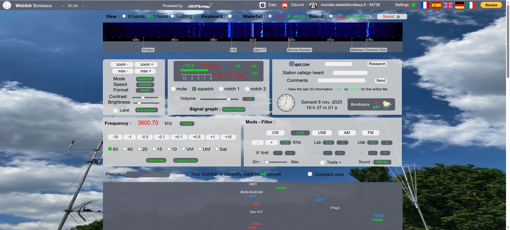

**Kuva 1.** Bordeauxissa sijaitsevan vastaanottimen verkkosivu

Taajuus kuvassa on 3600.70 khz. Modulaatio oli LSB.

## b) rtl_433. Asenna rtl_433 automaattista analyysia varten. Kokeile, että voit ajaa sitä. './rtl_433' vastaa "rtl_433 version 25.02 branch..."

**8.11.2025 Klo 19.56**

Asensin rtl_433 ohjelman komennoilla

```bash
sudo apt-get update

sudo apt-get install rtl-433
```

## c) Automaattinen analyysi. Mitä tässä näytteessä tapahtuu? Mitä tunnisteita (id yms) löydät? [Converted_433.92M_2000k.cs8](https://terokarvinen.com/verkkoon-tunkeutuminen-ja-tiedustelu/samples/Converted_433.92M_2000k.cs8). Analysoi näyte 'rtl_433' ohjelmalla.

Kysyin ChatGPT:ltä "how to run file with rtl_433" ja sain vastauksena komennon

```bash
rtl_433 -r (tiedostopolku)
```

**9.11.2025 Klo 09.00**

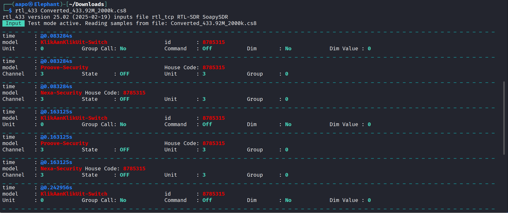

**Kuva 2.** Osa tarkasteltavasta tiedostosta

Tiedostossa oli todennäköisesti jokin kodin turvajärjestelmä, koska "model: Proove-Security" ja "model: Nexa-Security" kohdissa olivat kentät "House Code". Löysinkin Nexa Systemin kotisivut, jotka liittyivätkin kodin IoT-laitteisiin (NEXA SYSTEMS. URL: [NexaSystem](https://nexasystem.com/)).

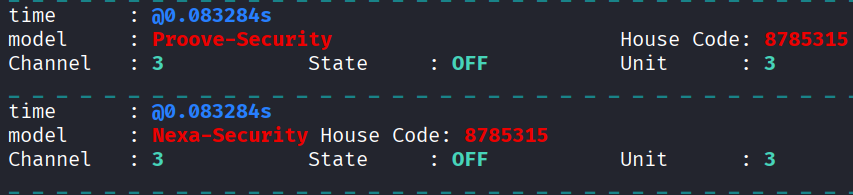

**Kuva 3.** Nexa-Security ja Proove-Security sarakkeet

En löytänyt oikein hakukoneiden kautta tietoa, mikä oli "Group Call" sarake, mutta ChatGPT sanoi sen olevan broadcast-viestiin liittyvä. Eli jos arvona on "Yes" viesti on broadcast ja jos arvona on "No" viesti ei ole broadcast.

(ChatGPT. Syöte: what is group call in rtl_433)


**Kuva 4.** Viesti ei ollut broadcast

## d) Too compex 16? Olet nauhoittanut näytteen 'urh' -ohjelmalla .complex16s-muodossa. Muunna näyte rtl_433-yhteensopivaan muotoon ja analysoi se. Näyte [Recorded-HackRF-20250411_183354-433_92MHz-2MSps-2MHz.complex16s](https://terokarvinen.com/verkkoon-tunkeutuminen-ja-tiedustelu/samples/Recorded-HackRF-20250411_183354-433_92MHz-2MSps-2MHz.complex16s)

**9.11.2025 Klo 09.50**

Sain avattua tiedoston muuttamalla tiedostopäätteen tiedoston nimessä komennolla

```bash
mv Recorded-HackRF-20250411_183354-433_92MHz-2MSps-2MHz.complex16s Recorded-HackRF-20250411_183354-433_92MHz-2MSps-2MHz.cs8
```

Minun piti toisinsanoen vaihtaa ".complex16s" muotoon ".cs8". Löysin ohjeen GitHubin keskustelusta.  

(GitHub. URL: [BMW GEN 3 TPMS signal decoding · Issue #2893 · merbanan/rtl_433 · GitHub](https://github.com/merbanan/rtl_433/issues/2893))

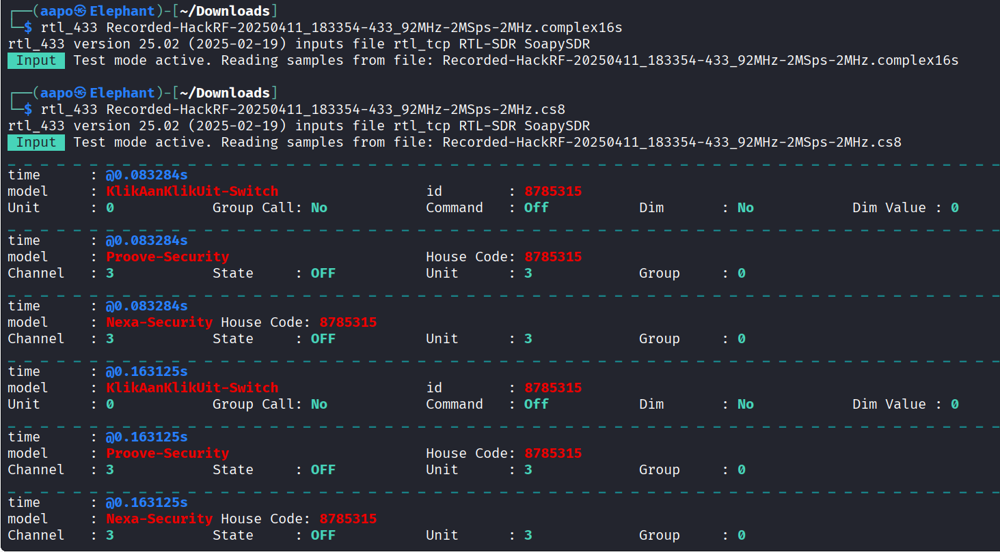

**Kuva 5.** Alkuperäisellä tiedostopäätteellä tiedosto ei avautunut

Tiedosto "Recorded-HackRF-20250411_183354-433_92MHz-2MSps-2MHz.complex16s", jonka sai ladattua tehtävän linkistä, on sama kuin "Converted_433.92M_2000k.cs8", joka oli tarkasteltavana c-kohdassa.

## e) Ultimate. Asenna URH, the Ultimate Radio Hacker.

**9.11.2025 Klo 13.44**

Katsoin tehtävän vinkeistä mallia, miten URH asennetaan. Siellä käytettiin pipx:ää.

Sain kuitenkin virheilmoituksen asennettaessa sitä.

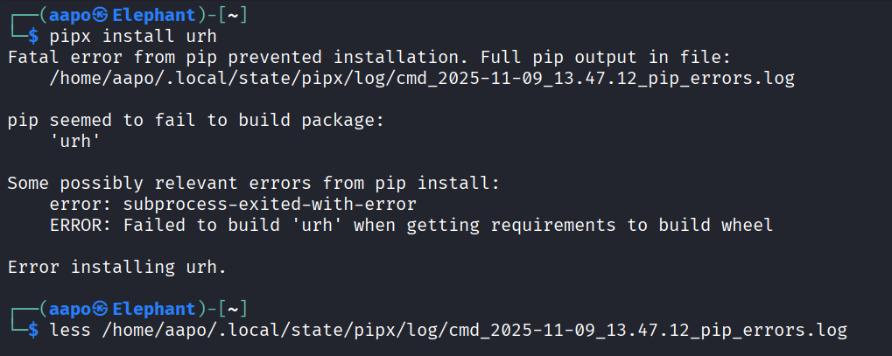

**Kuva 6.** Virheilmoitus asennettaessa URH ohjelmaa

Lähdin katsomaan lokitiedostoa, joka luki virheilmoituksessa.

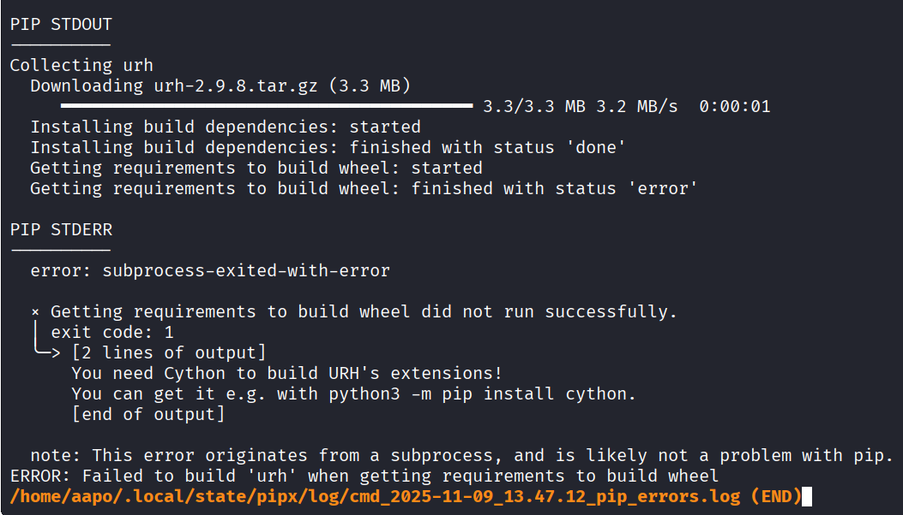

**Kuva 7.** Virheilmoitus lokitiedostossa

Lokitiedostossa luki, että tarvitsisin Cythonin. Latasin sen komennolla, joka luki virheilmoituksessa.

```bash
python3 -m pip install cython
```

Sain uudestaan virheilmoituksen

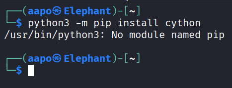

**Kuva 8.** Virheilmoitus asennettaessa Cythonia

Tajusin hieman surffailtuani netissä, että minun pitäisi varmaan laittaa komentoon "pip" sijaan "pipx". Sillä se onnistuikin.

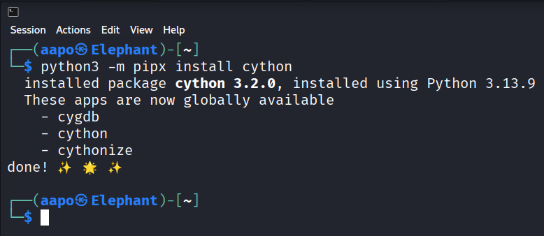

**Kuva 9.** Cythonin asennus onnistui

Mutta sama virheilmoitus edelleen

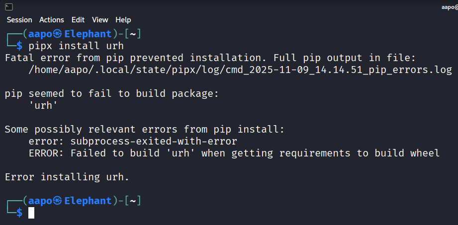

**Kuva 10.** Virheilmoitus jälleen asennettaessa URH:a

Kävin katsomassa jälleen virhelokia, mutta samanlainen ilmoitus sielläkin.

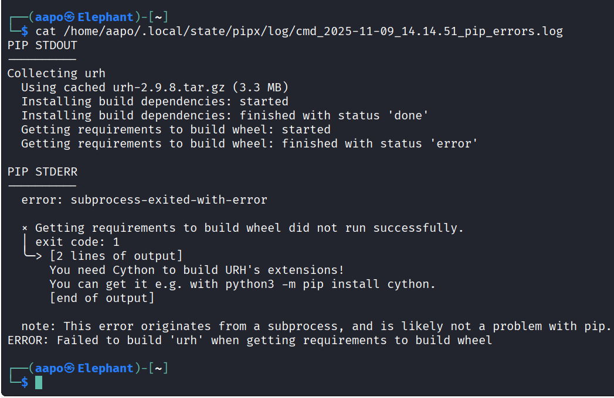

**Kuva 11.** Uusin virheilmoitus lokitiedostossa

Katsoin vielä ohjeita sivustolta [GitHub - jopohl/urh: Universal Radio Hacker: Investigate Wireless Protocols Like A Boss](https://github.com/jopohl/urh). Minulla alkoi aika loppumaan, joten päätin tehtävän tähän pisteeseen.

### Uusi yritys

**6.12.2025**

Tein aikaisemmin näitä tehtäviä, koska luulin niiden olevan pakollisia jo aiemmin. Kuitenkin ne pitikin vasta nyt tehdä, joten jatkoin siitä mihin olin jäänyt.

Asensin puhtaan Kalin, koska opettajan ohjeiden mukaan en saanut asennettua urhia jo olemassa olleeseen kaliin. Uusissa ohjeissa, jotka opettaja antoi tunnilla, oli tarkoitus kloonata urhin repo ja asentaa se suoraan siitä.

**6.12.2025 Klo 13.40**

Yritin ensiksi samalla tavalla kuin aiemmin, eli suoraan pipx:n avulla asentaa ilman kloonamatta repoa.

```bash
sudo apt-get update

sudo apt-get -y install pipx

pipx install urh #Koitin myös sudon kanssa, mutta sama virheilmoitus tuli
```

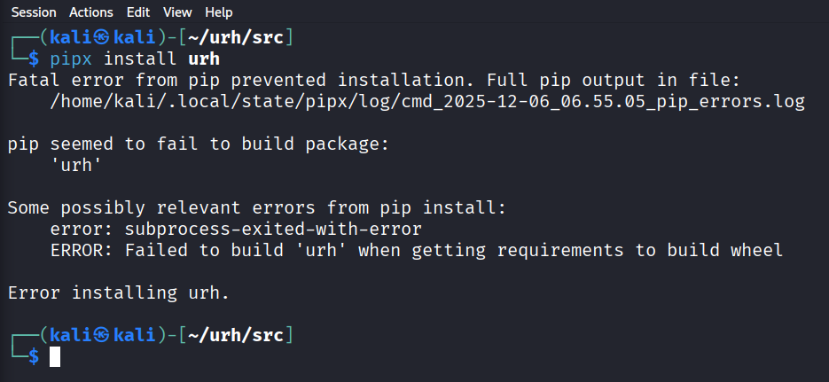

**Kuva 12.** Virheilmoitus asennettaessa urhia

Yritin tämän jälkeen asentaa urhia ensiksi kloonaamalla repon ja sitten asentamalla pipillä urhin.

```bash
git clone https://github.com/jopohl/urh.git #Kloonaa repon

cd urh #Siirtää hakemiston kloonattuun hakemistoon

pip install . #Asentaa hakemistossa olevan ohjelman. Yritin myös sudolla
```

Kuitenkin sain virheilmoituksen.

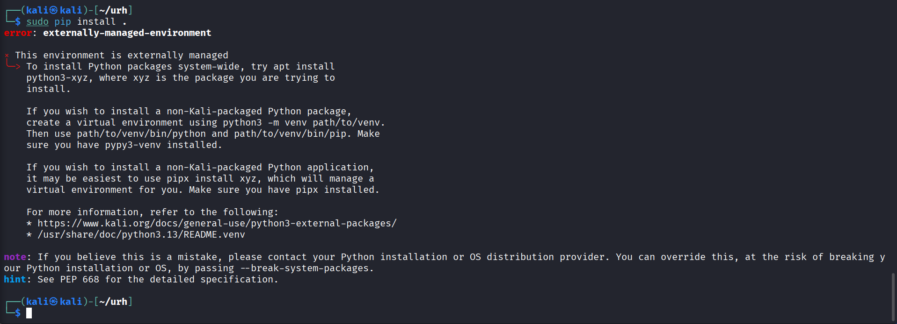

**Kuva 13.** Virheilmoitus asennettaessa toisella tavalla urhia

Yritin pipx:n kanssa myös asentaa.

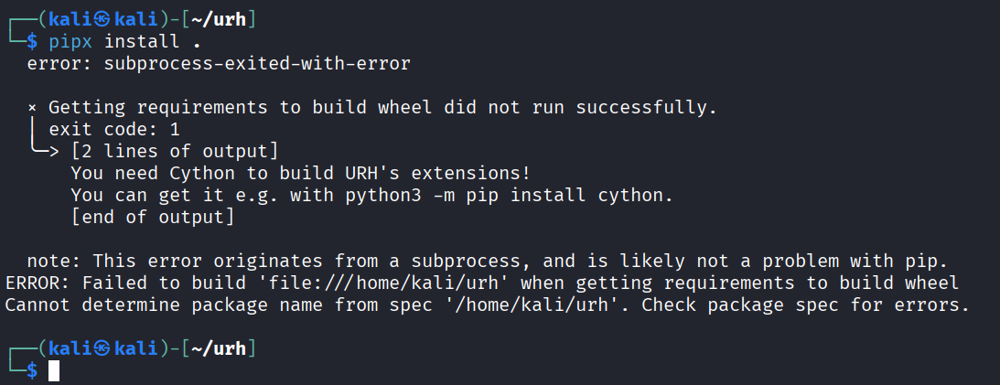

**Kuva 14.** Virheilmoitus pipx:n kanssa

**6.12.2025 Klo 19.29**

Päätin kokeilla toista ohjelmaa nimeltä "inspectrum", jonka pitäisi olla samankaltainen kuin urh. Inspectrumin sai asennettua suoraan apt-reposta. 

## Tarkastele näytettä [1-on-on-on-HackRF-20250412_113805-433_912MHz-2MSps-2MHz.complex16s](https://terokarvinen.com/verkkoon-tunkeutuminen-ja-tiedustelu/samples/1-on-on-on-HackRF-20250412_113805-433_912MHz-2MSps-2MHz.complex16s). Siinä Nexan pistorasian kaukosäätimen valon 1 ON -nappia on painettu kolmesti. Käytä Ultimate Radio Hacker 'urh' -ohjelmaa.

## f) Yleiskuva. Kuvaile näytettä yleisesti: kuinka pitkä, millä taajuudella, milloin nauhoitettu? Miltä näyte silmämääräisesti näyttää?

**6.12.2025 Klo 19.59**

Avasin inspectrumissa tehtävän tiedoston.

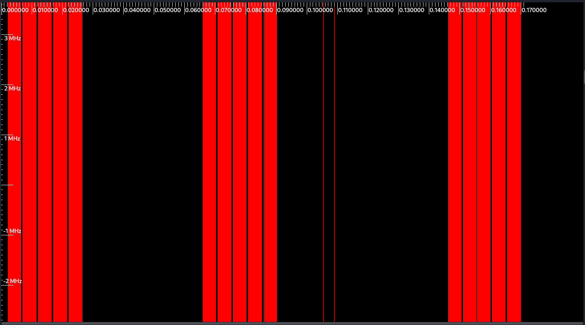

**Kuva 15.** Tehtävän tiedosto inspectrumissa

**6.12.2025 Klo 21.02**

Surffailin netissä tovin ja yritin hahmottaa, miten inspectrumia oikein käytetään? Pääsin vähän jyvälle, mutta minun piti turvautua toisen opiskelijan raporttiin, joka oli tehtävän vinkeissä (nurminenkasper. URL: [h3  Aaltoja harjaamassa](https://github.com/nurminenkasper/Verkkoon-tunkeutuminen-ja-tiedustelu/blob/main/h3/h3-Aaltoja-harjaamassa.md)).

Katsoin raportista, että tiedoston pituus pitäisi olla 5,49 sekuntia, joten päättelin sen perusteella "Sample rate" arvon olevan n. 248000.

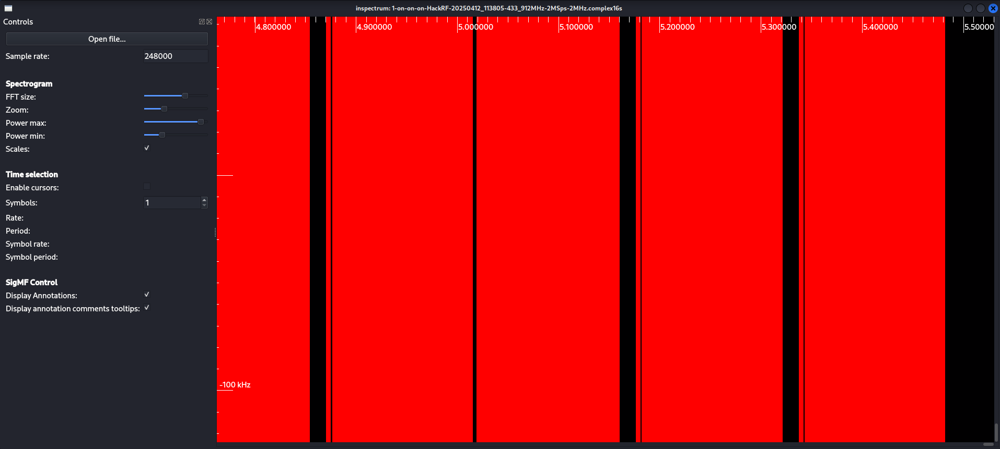

**Kuva 16.** Sample rate asetettu arvoon 248000

En osannut käyttää niin hyvin inspectrumia, että olisin löytänyt taajuuden siitä. Kuitenkin tiedoston nimestäkin jo oletan, että taajuus on ollut 433.912 MHz. Tiedoston nimestä voi päätellä myös sen nauhoittamisen ajankohdan, joka oli 12.4.2025.

Silmämääräisesti näytteessä oli kolme erilaista "sykliä". Tehtävänannossa sanottiinkin, että kaukosäätimen painiketta painettiin kolmesti.

## g) Bittistä. Demoduloi signaali niin, että saat raakabittejä. Mikä on oikea modulaatio? Miten pitkä yksi raakabitti on ajassa? Kuvaile tätä aikaa vertaamalla sitä johonkin. (Monissa singaaleissa on line encoding, eli lopullisia bittejä varten näitä "raakabittejä" on vielä käsiteltävä)

En saanut tehtyä tehtävää, vaikka selvittelin miten saisin demoduloitua inspectrumilla. Ilmeisesti se vaatisi todella paljon tietämystä asiasta.

## h) Vapaaehtoinen: Sdr++. Kokeile [sdr++](https://www.sdrpp.org/) -sovellusta ja esittele sillä jokin "hei maailma" -tyyppinen esimerkki.

En tehnyt kyseistä tehtävää.

## i) Vapaaehtoinen, vaikeahko: GNU Radio. Asenne [GNU Radio](https://www.gnuradio.org/) ja tee sillä yksinkertainen "Hei maailma".

En tehnyt kyseistä tehtävää.

## Lähteet

ChatGPT. Kielimalli: GPT-5. Syöte: how to run file with rtl_433. Generoitu: 8.11.2025.

ChatGPT. Kielimalli: GPT-5. Syöte: what is group call in rtl_433. Generoitu: 9.11.2025.

GitHub. 5.4.2024. BMW GEN 3 TPMS signal decoding #2893. Luettavissa: [BMW GEN 3 TPMS signal decoding · Issue #2893 · merbanan/rtl_433 · GitHub](https://github.com/merbanan/rtl_433/issues/2893). Luettu: 9.11.2025.

jopohl. GitHub. Luettavissa: [GitHub - jopohl/urh: Universal Radio Hacker: Investigate Wireless Protocols Like A Boss](https://github.com/jopohl/urh). Luettu: 9.11.2025.

NEXA SYSTEM. Luettavissa: [NexaSystem](https://nexasystem.com/). Luettu: 9.11.2025.

nurminenkasper. 15.4.2025. h3 Aaltoja harjaamassa. Luettavissa: [h3 Aaltoja harjaamassa](https://github.com/nurminenkasper/Verkkoon-tunkeutuminen-ja-tiedustelu/blob/main/h3/h3-Aaltoja-harjaamassa.md). Luettu: 6.12.2025.

<br>

<br>

<br>

<br>

<br>

<br>

*Tätä dokumenttia saa kopioida ja muokata GNU General Public License (versio 3 tai uudempi) mukaisesti. http://www.gnu.org/licenses/gpl.html*
